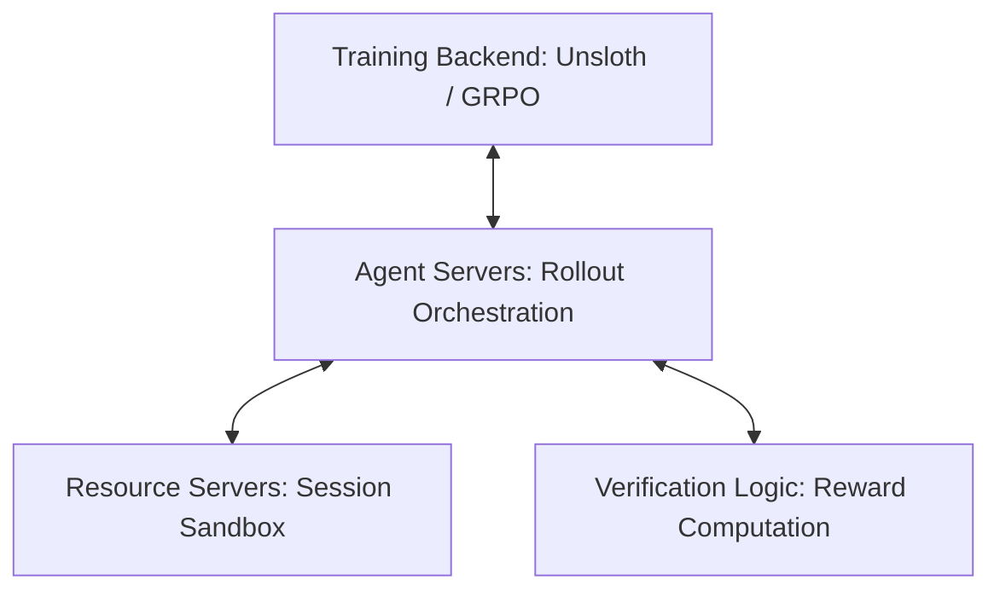

# Agentic RL 环境与 GRPO

## 定义与背景
在构建具备多步推理能力的 AI Agent 时，强化学习（Reinforcement Learning, RL）环境扮演着模拟真实世界的关键角色。然而，当前推理大模型 Agent 的主要瓶颈并不在于训练算法本身，而在于**强化学习环境（Environment）**的构建与管理。

由于 GRPO（Group Relative Policy Optimization）或 PPO（Proximal Policy Optimization）等训练算法在本质上仅作为优化器，根据奖励信号来更新模型权重，因此生成高质量、高吞吐的训练轨迹和可靠的反馈才是最大的挑战。

## 紧耦合的弊端
在传统 RL 工作流中，环境的交互逻辑、状态维护和奖励打分通常与训练管道（Training Pipeline）紧密耦合。
这种耦合会导致以下弊端：
1. **迭代缓慢**：每次调整环境逻辑（例如修改奖励函数或添加工具）都必须修改优化器或训练框架的代码。
2. **扩展性差**：训练框架通常需要高度并行的 GPU 资源，而环境运行（如启动沙箱、执行代码）则消耗 CPU/内存。紧耦合导致计算资源难以独立横向扩展。
3. **调试困难**：环境中的异常或状态泄露容易污染训练数据，且难以隔离排查。

## 核心解耦架构
为了解决上述瓶颈，现代 Agentic RL 基础设施（如 NVIDIA NeMo Gym）采用了将环境逻辑与训练 backend 彻底解耦的架构：

### 1. Agent Servers（编排 rollouts）
* **定位**：负责宏观上的 Rollout 任务编排与分发。
* **机制**：它作为中介，接收训练后端的请求，协调 Agent 策略与环境的交互，并将最终生成的完整轨迹（trajectories）返回给训练后端。

### 2. Resource Servers（多轮 session 隔离与沙箱）
* **定位**：维护多轮交互过程中的状态以及代码执行的物理资源隔离。
* **机制**：针对 Agentic RL 中特有的工具调用（Tool Calls），为每个 rollout 实例拉起独立的沙箱执行上下文（Sandboxed Execution Contexts），并在交互结束后自动清理资源，确保无状态泄露。

### 3. Verification Logic（奖励校验逻辑）
* **定位**：定义并执行“好”与“坏”的判断标准。
* **机制**：独立于优化器，用于计算每个 rollout 步长或结束时的奖励信号。通过解耦，开发者可以单独迭代奖励函数和规则库，而无需触碰任何训练后端代码。

### 4. Training Backend（训练后端）
* **定位**：纯粹的优化器引擎。
* **机制**：如 Unsloth 框架，专门负责消费 Agent Servers 收集到的 rollout 轨迹，运行 GRPO 等算法，计算策略梯度并高效更新模型权重。它不感知具体的沙箱细节或工具实现。

---
> 📎 **来源摘要**：[[wiki/sources/2026-03-13_What-are-RL-environments,-and-how-to-build-them_19ce93.md]]
