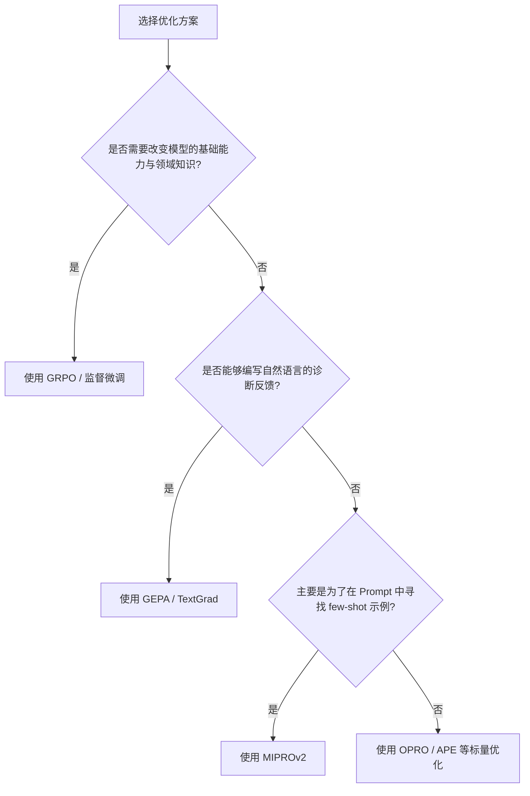

# GEPA 提示词进化算法

## 1. 定义
**GEPA (Gradient-free Evolutionary Prompt Algorithm / 无梯度提示词进化算法)** 是一种针对复合 AI 系统（Compound AI Systems，如多模块 Prompt 管道）的提示词自动优化算法。GEPA 不需要更新大模型的参数权重，而是将系统运行过程中的完整执行轨迹（Rollout Trace）交由一个反射大模型（Reflection LLM），通过自然语言的反思与改写来迭代优化各模块的 Prompt，从而在多模块协同任务上达到甚至超越强化学习（如 GRPO）的效果。

## 2. 传统 RL 算法的“标量信号压缩/稀疏瓶颈”
在使用 GRPO 或 PPO 等传统强化学习算法训练大语言模型时，每次 Rollout 都会产生长达数千 Token 的丰富轨迹（包含思考链推理、工具调用、自纠错步骤、编译器报错等信息）。
然而，传统 RL 会将这几千 Token 的丰富多维诊断信号压缩成一个**单标量奖励值（Scalar Reward）**。策略梯度仅根据这一位（1-bit）反馈对模型参数进行反向传播。这种粗暴的信号压缩扔掉了绝大部分有价值的结构化诊断信息，导致 RL 算法收敛极慢，通常需要数万次 Rollout 才能达到收敛。

## 3. GEPA 核心构件

### ① 混合反馈函数 $\mu_f$
GEPA 摒弃了纯标量反馈，引入混合反馈函数 $\mu_f$。该函数输出不仅包括任务的数值分数，还包含详尽的**自然语言诊断描述**。例如：
- **代码生成**：返回具体的编译器报错信息与性能分析 trace。
- **多跳问答**：指明在第几步检索到了哪些文档，还缺失哪些文档。
- **格式规范**：指出在第几步违反了哪条特定的指令约束。

### ② 6步进化循环
GEPA 的主循环如下执行：
1. **采样 (Selection)**：从当前 prompt 种群中根据 Pareto 采样策略选择一个候选 Prompt 集合。
2. **突变 (Mutate)**：轮询选择一个需要突变优化的模块。
3. **Rollout (运行)**：从训练集中随机采样少量（如3个）样本进行前向运行。
4. **获取反馈 ($\mu_f$ Feedback)**：收集完整的运行轨迹（Traces）以及反馈函数 $\mu_f$ 产生的自然语言诊断信息。
5. **反思重写 (Reflection)**：将 Prompt、Trace、$\mu_f$ 诊断信息喂给 Reflection LLM，指示其找出错误原因并重写生成新的 Prompt。
6. **验证抉择 (Validation)**：在相同的运行样本上对新 Prompt 进行回测。若表现优于旧 Prompt 则予以保留（Accept），否则予以丢弃（Discard）。

### ③ Pareto 采样选择 (Quality-Diversity)
在多任务或多约束的场景下，传统贪心优化倾向于只保留平均得分最高的 Prompt，这会导致“向均值收敛”的局部崩溃。
GEPA 采用 **Pareto 采样选择** 机制：只要某个 Prompt 候选在**哪怕一个**子任务上取得了最优表现，它就会被保留在种群中。在选择突变亲本时，会依据它们在各个任务上的胜出频率进行加权采样。这确保了种群的多样性，让不同维度的特化策略有机会在后续进化中融合成更强的全局 Prompt。

## 4. 横向对比决策树
在构建复合 AI 系统时，GEPA 与其他技术的对比决策如下：

- **GEPA**：适用于小训练集、Rollout 昂贵、无法修改权重、能以自然语言清晰描述评估规则的场景。
- **GRPO**：适用于计算资源充沛、开源权重模型、有明确且易于验证的自动裁判（如代码通过率、数学解匹配）场景。
- **TextGrad**：适用于计算图极深、需要跨多个变量进行链式 critique 传播的严苛结构。
- **MIPROv2**：侧重于在 Prompt 中寻找和拼接最佳的 bootstrapped 示例。

## 5. 2026 实战黄金样本律
根据 2026 年（如 Decagon 生产环境消融实验）的最新业界共识，GEPA 在样本规模上存在“过犹不及”的特征：
- **黄金样本数**：**20 到 100 个样本** 往往能击败 500 个以上的样本。
- **成因**：Reflection 模型需要从失败轨迹的模式中提取具体的修改策略。当训练样本量过大时，数据中的随机噪声会干扰 Reflection 模型的注意力，使其倾向于针对偶发性噪音进行过度拟合与反复修改，反而破坏了 Prompt 的通用性。

---
> 📎 **物理文献**：[[wiki/sources/2026-05-01_How-to-beat-GRPO-without-touching-model-weights_19de58.md]]
