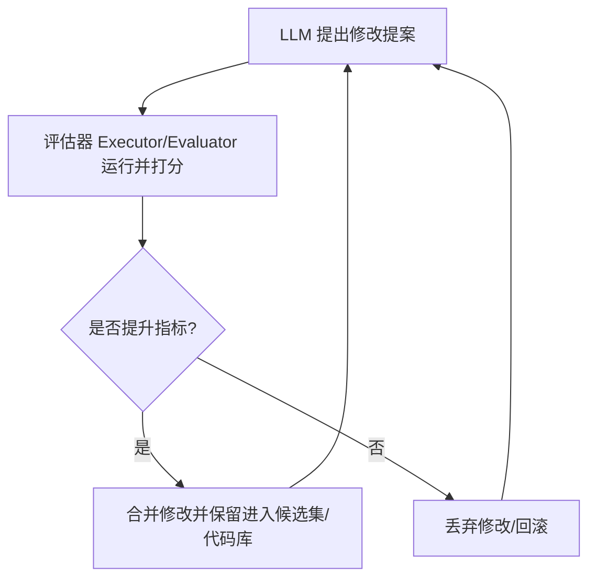

# 概念：LLM系统自动优化方法论

## 1. 定义
**LLM系统自动优化方法论**（Automatic Optimization for LLM Systems）是指**以大语言模型（LLM）来自动优化大语言模型系统（包括提示词、工作流管道、代码逻辑等）的自动反馈演进闭环**。
其核心范式遵循以下闭环逻辑：

通过将原本需要人工试错的 Prompt Engineering 和代码调优过程转化为自动搜索与反馈控制问题，使大模型系统具备自主迭代与进化的能力。

## 2. 六大前沿自动优化技术对比

| 优化技术名称 | 提出机构/框架 | 核心机制与优化目标 | 优势与突破点 | 局限性与失败风险 |
| :--- | :--- | :--- | :--- | :--- |
| **OPRO** | Google DeepMind | 将 LLM 作为优化器。维护包含过去提示词及得分的 Leaderboard，通过 Meta-prompt 提示词演进要求大模型在每一轮中生成更强的指令。 | 极其简单，无需梯度，仅需要评分标签即可自我优化。通常会发现“深呼吸”、“逐步思考”等效果好但人工难想到的提示词。 | 在困难任务上容易陷入瓶颈（Plateau），对 Meta-prompt 敏感，无法应对超大规模问题。 |
| **MIPROv2** | DSPy 框架 | 同时优化**指令文本**与 **Few-shot 示例**。它基于已成功运行的标注数据生成 candidate few-shot 示例，并通过贝叶斯搜索（Bayesian Search）寻找两者的最优组合。 | 两者协同优化，比单纯优化其中之一更具连贯性；在拥有数百个标注样本时非常高效。 | 候选集池在前期锁定，无法根据具体失败的 Trace 动态生成，且多轮打分试验的算力开销巨大。 |
| **TextGrad** | 斯坦福大学 (Stanford) | 借用 PyTorch 的反向传播思想，将多步 AI 管道抽象为以文本为节点、LLM 调用为边的计算图，向后传导自然语言批评（Criticism）以更新各个节点的文本。 | 能够优化整个多步 Pipeline 和非文本人工制品（如药物分子结构），开发接口符合 PyTorch 风格，极易上手。 | 随着计算图深度增加（超过 3-4 层），自然语言反馈流容易变得不稳定而发散，每次迭代的 LLM 调用成本高昂。 |
| **GEPA** | 加州大学伯克利分校 (Berkeley) | 交叉链入：[[wiki/concepts/概念_GEPA提示词进化算法]]。 通过阅读**完整执行 Trace**进行错误诊断并提出精准的 Targeted Fix；维护 **Pareto（帕累托）集**以保留局部特化专家（Specialist）样本。 | 零模型权重修改；基于 Trace 反馈而非单一打分，收敛速度极快，防止了窄领域优秀的 Specialist 被过早平均化淘汰。 | 强依赖于执行 Trace 的丰富度，如果任务无法提供详尽的诊断 Trace，则无法使用该算法。 |
| **AlphaEvolve** | Google DeepMind | 面向**代码生成与演进**的系统。由两个 Gemini 模型（一个负责深度，一个负责广度）共同向程序提出 Diff，自动评估器打分，优秀代码存入数据库演进。 | 产生人类未曾发现的高效算法。如矩阵乘法突破了 56 年前的经典算法极限，并优化了 Google 生产环境的调度器。 | 必须存在能够由机器精确测量的自动化评估器（例如验证矩阵相乘的正确性），搜索空间巨大，极其消耗算力。 |
| **AutoResearch** | Andrej Karpathy 个人实践 | 针对机器学习训练脚本的自主实验循环。Agent 编辑代码，自动运行 5 分钟短实验，成功则 Git commit 锁死演进，失败则 Git reset 回滚。 | 单向演进，代码库永远不 regression。Git 提交历史直接成为了直观、可读的实验日志。发现并修复了 attention 的隐蔽 bug。 | 由于不能退一步以进两步，极易陷入局部最优（Local Optimum），且实验必须高度确定性和可对比。 |

## 3. 设计与选型第一性原理
在选择 LLM 自动优化方法时，决策往往基于两个核心维度：**被优化对象的本质属性**（提示词、计算图、亦或代码逻辑）与**可度量的反馈丰富度**（单一数值 Score、详尽的 Execution Trace、还是机器可判定的单元测试）。没有万能的优化器，其核心权衡在于计算成本与收敛速度的博弈。

---
> 📎 **物理文献**：[[wiki/sources/2026-07-31_6-automatic-optimization-methods-for-LLM-systems_19fb9f.md]]
