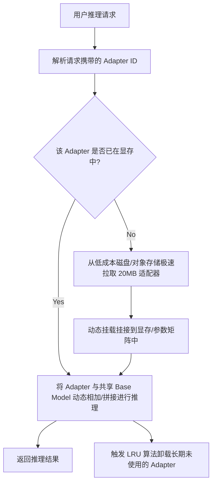

# 概念: LoRA与QLoRA微调

**LoRA (Low-Rank Adaptation，低秩适应)** 和 **QLoRA (Quantized Low-Rank Adaptation，量化低秩适应)** 是大语言模型 (LLM) 时代最主流的参数高效微调 (Parameter-Efficient Fine-Tuning, PEFT) 技术。它们在实现模型定制化的同时，极大地降低了计算、存储和部署成本。

## 1. LoRA 的数学机制与低秩分解
传统的全参数微调会对大模型的所有权重矩阵进行更新。假设原始预训练矩阵为 $W_0 \in \mathbb{R}^{d \times k}$，微调过程实际是学习一个累积参数更新矩阵 $\Delta W \in \mathbb{R}^{d \times k}$，使得最终权重为 $W = W_0 + \Delta W$。在大模型中，$d$ 和 $k$ 的维度极高，直接训练并存储 $\Delta W$ 带来了巨大的算力和空间开销。

LoRA 的核心思想是基于**“内在秩假说”**：参数更新矩阵 $\Delta W$ 在模型微调任务中实际上具有很低的“内在秩（Intrinsic Rank）”。因此，LoRA 引入了低秩分解机制：
- **参数冻结**：冻结原始预训练权重 $W_0$，在微调期间不改变其数值。
- **低秩矩阵引入**：用两个低秩矩阵 $A \in \mathbb{R}^{r \times k}$ 和 $B \in \mathbb{R}^{d \times r}$ 的乘积来近似表示 $\Delta W$：
  $$\Delta W \approx B \cdot A$$
  其中，超参数 $r$ 称为**秩 (Rank)**，满足 $r \ll \min(d, k)$（通常 $r$ 取个位数，如 4、8）。
- **初始化设计**：
  - 矩阵 $A$ 采用高斯分布随机初始化。
  - 矩阵 $B$ 初始化为零矩阵，使得在微调开始时 $B \cdot A = 0$，保证初始前向传播的输出与原始模型完全一致。
- **前向传播计算**：
  $$h = W_0 x + \Delta W x = W_0 x + \frac{\alpha}{r} (B \cdot A) x$$
  （其中 $\alpha$ 是缩放常数，用于稳定不同秩下的梯度更新）。

## 2. 商业与工程视角：全参数微调 vs LoRA 适配器
在构建面向大客户或数万普通用户的平台级 LLM API 服务（多租户服务，Multi-tenant Serving）时，LoRA 展示出了全参数微调无法比拟的商业优势。

| 维度 | 全参数微调 (Full Fine-Tuning) | LoRA 适配器模式 (LoRA Adapter serving) |
| :--- | :--- | :--- |
| **存储开销** | **极大**。每个微调用户都需要存储一份独立的模型副本（如 175B 的 GPT-3 在 float16 下单副本需 **350GB**）。对于 100k 个定制模型，需 **3500 万 GB**。 | **极小**。仅存储底层的 $A$ 和 $B$ 矩阵（通常每个 Adapter 只有 **20-25MB**）。100k 个定制模型仅需 **2,000-2,500 GB**。 |
| **硬件部署成本** | **高昂且不可持续**。若将所有用户的定制模型都长驻显存，显卡开销无法想象；若不长驻，频繁的冷启动加载 350GB 模型将产生巨大的物理延迟和网络带宽负担。 | **经济且高效**。所有租户共享同一块 GPU 上驻留的单个物理基座模型（Base Model），仅需在显存中为活跃用户动态挂载其几百兆的 LoRA 权重。 |
| **商业结算友好度** | **差**。用户微调后可能仅有极低的使用频次，但平台必须为其备好高额存储和潜在的冷启动资源，导致难以设计灵活的按量付费模式。 | **优**。适配器体积相当于一张普通照片，即使大量闲置，存储开销也微乎其微，平台能够轻松支持长尾客户。 |

## 3. 运行逻辑：动态挂载、热插拔与冷启动
为了在多租户架构中实现极致的资源复用，LoRA 适配器在服务框架（如 vLLM、S-LoRA）中常采用以下运行逻辑：

1. **共享底座模型**：GPU 显存中常驻一个被冻结的基座大模型（如 Llama-3-70B）。
2. **动态挂载 / 热插拔（Hot Swapping）**：
   - 当接收到属于用户 A 的请求时，服务网关识别出其对应的 `Adapter-A`。
   - 框架在前向传播计算中，将底座模型的激活值分别输入底座 $W_0$ 和用户特定的轻量适配器 $B_A \cdot A_A$，再把两者的输出融合成最终表示。此机制不需要修改底座权重。
3. **冷启动与按需换入换出（Swap-in/Swap-out）**：
   - **离线换出**：长期没有请求的 `Adapter-A` 会被 LRU（最近最少使用）缓存策略从显存清理，只存放在磁盘或廉价的冷存储中。
   - **极速冷启动**：一旦用户 A 发来新请求，由于 LoRA 文件极小（20MB），系统可以在毫秒级内从磁盘将适配器权重读入显存并完成加载，用户端几乎感知不到冷启动带来的延迟，完美兼顾了高并发与低功耗。
