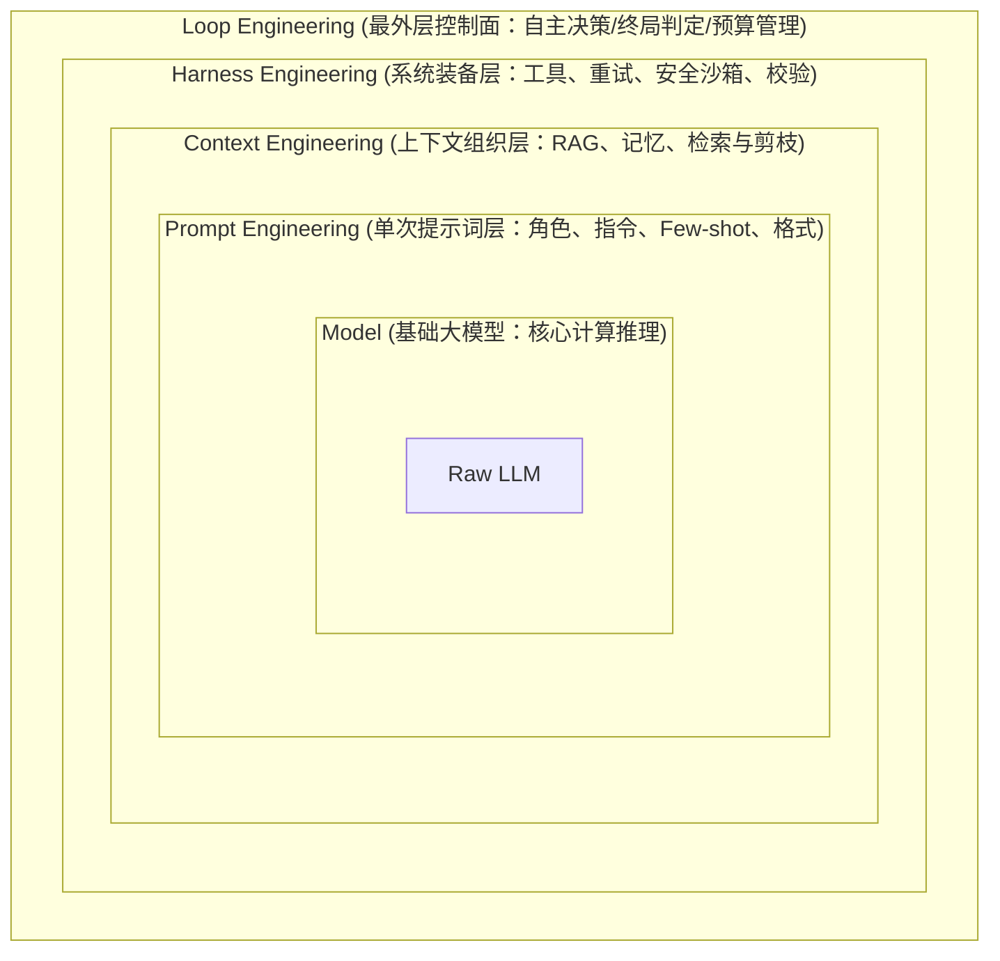

# 概念：上下文工程（Context Engineering）

## 核心决定资产比例

在 2026 年，决定一个 AI 应用输出质量的资产分配大致为：**15% 模型选择 + 10% Prompt + 75% 上下文工程外围系统**（如检索、记忆、工具与查询处理）。团队往往过度关注模型和提示词，而忽略了真正起决定性作用的上下文工程外围系统。

## 定义

上下文工程 = 构建动态系统，以合适的格式为LLM提供正确的信息和工具，让LLM合理完成任务。

Andrej Karpathy 定义："一门将恰到好处的信息在下一步需要时填入上下文窗口的精妙艺术与科学。"

## 与提示工程的区别

| 对比维度 | 提示工程 | 上下文工程 |
|--------|---------|-----------|
| 关注点 | 词句技巧和表达方式 | 提供全面上下文 |
| 作用范围 | 只限任务描述表达 | 包含文档、示例、规则、模式和验证 |
| 类比 | 贴便签 | 写详细剧本 |

快手面试复盘给出了一个项目化表述：Prompt Engineering 解决任务如何表达，Context Engineering 负责每次调用前动态组织系统指令、工具列表、外部数据和聊天历史，Harness Engineering 再为执行过程补上状态、权限、重试、安全护栏与监控。该表述与本页的分层框架一致。

## 上下文的七个组成部分

1. 指令/系统提示词
2. 用户提示词
3. 对话历史（短期记忆）
4. 长期记忆（跨对话持久知识）
5. 检索信息（RAG）
6. 可用工具定义
7. 结构化输出格式

## 四类核心操作（LangChain 方法论）

- **Offload（卸载）**：信息外化到文件系统/数据库，上下文只保留引用
- **Retrieve（检索）**：RAG 或文本检索（grep/find）按需取回
- **Reduce（压缩）**：摘要、rerank、语义总结裁剪冗余
- **Isolate（隔离）**：SubAgent 分而治之，各自独立上下文

## 上下文工程的 6 个核心组件与实践策略

根据最新 AI 工程实践，上下文工程主要由以下 6 个核心组件与策略构成：
1. **提示词技术（Prompting Techniques）**：不仅限于传统的 Few-shot 模式识别，还包括 Chain-of-thought（CoT）推理链等先进提示技术，为模型提供足够的思维和推理空间。
2. **查询增强（Query Augmentation）**：针对用户模糊或过于简短的原始查询进行优化。包括：
   - **Query Rewriting（查询重写）**：由 LLM 转换和明确模糊问题。
   - **Query Expansion（查询扩展）**：增加同义词与相关术语扩大检索面。
   - **Query Decomposition（查询分解）**：将复杂问题拆分为可独立回答的子问题。
   - **Query Agents（查询智能体）**：使用 Agent 根据初步检索结果动态重构查询。
3. **长期记忆（Long-term Memory）**：利用向量数据库（语义检索）与图数据库（实体与关系检索），维持跨会话的记忆。包括情景记忆（Episodic Memory，特定事件）、语义记忆（Semantic Memory，事实与背景）和程序性记忆（Procedural Memory，用户习惯和流程规范），典型工具如 **Zep Graphiti**。
4. **短期记忆（Short-term Memory）**：指单次会话历史记录的管理。需合理控制大小和顺序，避免噪声冲淡关键信号，通常通过 Compaction（压缩）与 Summarization（摘要）策略进行窗口整理。
5. **知识库检索（Knowledge Base Retrieval）**：实现企业数据与 AI 应用的深度连接。检索管道分为三层：
   - **Pre-retrieval（检索前）**：涉及合理的文档切块（chunking）策略、保留元数据以及表格和结构化数据处理。
   - **Retrieval（检索中）**：选择合适的嵌入模型、执行混合检索（Vector + BM25）及 Rerank 重排。
   - **Augmentation（增强阶段）**：进行上下文格式化、冲突排歧与引用源标注。
6. **工具与智能体（Tools & Agents）**：通过工具扩展模型的能力边界。
   - 包含单 Agent（简单任务）与多 Agent 协作（复杂流程分工）架构。
   - 引入 **MCP（Model Context Protocol，模型上下文协议）**，将传统的 $N \times M$ 对接简化为 $N + M$ 对接，大幅降低集成复杂度。

## 为什么选择上下文工程而非微调

- 微调需要固定行动空间，行动空间变化（如MCP发布）会使已训练模型失效
- 微调周期长（1-2周），无法支持产品快速迭代
- 上下文工程是应用层和模型层之间最清晰的战略边界
- "如果模型进步是上涨的潮水，我们希望是船，而不是钉在海床上的柱子。"

## 演进路线（四层抽象阶梯）

1. **第一层：提示工程 (Prompt Engineering)** — 关注“怎么说话模型才会照做”
2. **第二层：上下文工程 (Context Engineering)** — 关注“模型看到了什么”
3. **第三层：Harness Engineering** — 关注中间运行时约束，“模型的可靠性是 Harness 的问题”
4. **第四层：Loop Engineering** — 关注“怎么让系统自主决定下一步”，把工程师从循环内部移到外部

### 由内而外的嵌套逻辑关系 (同心圆/包裹逻辑)

这种由内而外的包裹关系表明，每一层都在其内层的基础上扩展了系统的功能与控制范围。最核心的 Model 提供原始推理能力；Prompt 工程确定单次输入格式；Context 工程管理当前交互的所有信息流动；Harness 工程为该次交互构筑可靠的系统环境（运行工具、错误捕获等）；而 Loop 工程则是最外层，管理多轮交互的自适应自转和停机条件。

## 来源

- [[Context_Engineering_LangChain_Manus_NotebookLM]]
- [[Manus创始人手把手拆解上下文工程]]
- [[浅谈上下文工程_Claude_Code_Manus_Kiro]]
- [[也许当前最好的上下文工程讲解_LangChain联合Manus]]
- [[从提示员到系统架构师：Loop Engineering 的范式跃迁]]
- [[Anthropic x ClaudeCode 官方插件：AI Agent 的领域知识插件——鸟窝]]
- [[2026-06-25_6-components-of-context-engineering_19f00c]]
