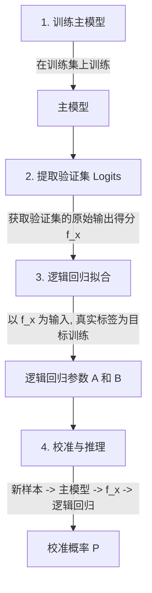

# 分类模型校准

在许多实际的机器学习应用场景中，分类器输出的不仅应当是类别标签，更需要是准确的概率预测。当模型的预测概率直接反映真实世界的事件发生频率时，我们称该模型是**校准良好**的。

---

## 1. 模型校准的定义与实际价值

### 什么是模型校准 (Model Calibration)？
对于一个二分类器，若其输出预测为正类的概率（置信度）为 $p$，那么在所有预测置信度接近 $p$ 的样本群体中，实际为正类的样本比例应当也接近 $p$。
例如，如果气象模型预测明天有 80% 的概率下雨，那么在 100 个给出相同预测的日子里，应当有大约 80 天实际发生了降雨。

### 实际应用价值
在许多关键的辅助决策系统中，粗糙的“硬分类（Hard Label）”是远远不够的，必须要依赖“软概率（Soft Probability）”：
- **医疗诊断与公共决策**：在大笔开支医疗诊断、政府资金配置决策中，过度自信的无校准模型（如 ResNet 平均置信度达 90% 但准确度仅 70%）可能直接导致资源分配偏差或决策失效的严重危害。此时，医生或筹款资助机构不仅需要知道患者是否有病，更需要根据准确的患病概率（如 75% 对比 15%）来评估治疗期望收益，从而合理分配昂贵或稀缺的医疗与公共资源。
- **自动驾驶与机器人**：基于概率估计来评估避障风险和计算动作的期望成本。
- **风控与反欺诈**：结合交易欺诈的概率和交易金额，计算期望资金损失，以决定是否触发拦截或人工审核。

---

## 2. 现代深度模型的“过度自信”挑战

早期的浅层机器学习模型（如朴素贝叶斯、浅层神经网络 LeNet）通常具有良好的校准性。然而，现代深层网络（如 ResNet, DenseNet, Transformer 等）在显著提高预测准确率（Accuracy）的同时，其预测置信度（Confidence）却发生了严重的系统性失真——表现为普遍的**过度自信（Overconfidence）**。

### LeNet 与 ResNet 的对比（在 CIFAR-100 上）

```
+--------------------------------------------------------+
| 传统小模型 (LeNet)                                     |
| [准确率: ~55%] <---------------------> [置信度: ~54%]  |
| (校准良好，置信度贴合实际水平)                          |
+--------------------------------------------------------+
| 现代深模型 (ResNet)                                    |
| [准确率: ~70%] <-------- 巨大缺口 --------> [置信度: ~90%] |
| (过度自信，模型表现出虚假的确定性)                     |
+--------------------------------------------------------+
```

### 为什么深度模型会过度自信？
深度神经网络通常拥有数以千万计的参数。为了将交叉熵损失（Cross-Entropy Loss）降到最低，模型在训练时不仅会学习正确的决策边界，还会不断将正确类别的 Logits 值推高。由于 Softmax 函数的性质，这会导致即使在模型判断并不绝对有把握的样本上，输出的预测概率也会极其接近 `1.0`（或 `0.0`），导致概率分布发生严重的两极分化。

---

## 3. Platt 缩放 (Platt Scaling) 物理映射机制与四步法

Platt 缩放（Platt Scaling）是由 John Platt 提出的一种简单且广泛使用的二分类模型校准技术。

### 物理映射机制
Platt Scaling 的物理映射本质上是**在主模型的原始预测得分（Logit）与真实标签概率之间，训练一个 Sigmoid 映射函数**。
设主模型对样本 $x$ 的未归一化输出（即 Logit，对于 SVM 则是样本到超平面的代数距离）为 $f(x)$，Platt Scaling 形式化为：
$$P(y=1 | f(x)) = \frac{1}{1 + \exp(A \cdot f(x) + B)}$$
其中，$A$ 和 $B$ 是标量参数。通过拟合这两个参数，Sigmoid 函数可以平滑、拉伸或缩放 Logit 分数，从而将其校准到真实概率空间。

### 算法四步步骤



1. **训练主模型**：在原始训练集上训练主模型（例如神经网络或支持向量机）。
2. **提取验证集 Logits**：将独立的验证集（在校准领域通常称为**校准集 Calibration Set**）样本输入训练好的主模型，获取激活函数（如 Sigmoid）前一步的原始预测分数（Logits） $f(x)$。
3. **逻辑回归拟合**：以验证集上取得的 $f(x)$ 作为特征自变量，以验证集样本的真实二进制标签 $y \in \{0, 1\}$ 作为因变量，拟合一个一维逻辑回归模型，学习得到最优参数 $A$ 和 $B$。
4. **校准与推理**：对于任意新样本，先通过主模型前向传播计算出其 Logit $f(x_{new})$，然后将其代入拟合好的公式中：
   $$P_{calibrated} = \frac{1}{1 + \exp(A \cdot f(x_{new}) + B)}$$
   输出的 $P_{calibrated}$ 即为校准后的置信概率。

---

## 4. 典型应用与局限性

### 典型应用：支持向量机 (SVM)
经典的支持向量机（SVM）是一种非概率的最大间隔分类器，它只输出样本到超平面的几何距离。Platt 缩放最初就是为了解决这一痛点而提出的。通过将 SVM 输出的距离 $f(x)$ 作为 Logit 输入，Platt Scaling 可以将 SVM 完美转化为概率型分类器。

### 局限性
1. **对校准集数据量极其敏感**：由于 $A$ 和 $B$ 是在独立的校准集（验证集）上拟合的，如果**校准集的数据量较小**，逻辑回归极易发生过拟合或欠拟合，导致估计出来的 $A$ 和 $B$ 稳定性降级，从而使得输出概率失真。
2. **二分类局限**：原生的 Platt Scaling 仅针对二分类模型设计。若要扩展到多分类模型，需要采用其变体技术（如温度缩放 Temperature Scaling，通过学习一个共享的温度因子 $T$ 来平滑 Softmax 输入）。
