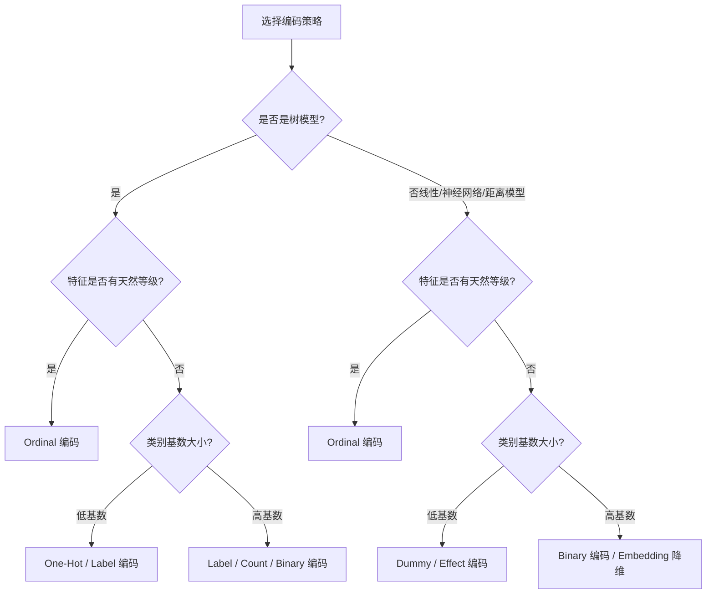

# 类别特征编码技术

类别特征编码（Categorical Data Encoding）是机器学习特征工程中的基石环节。由于大多数数学模型（如线性模型、支持向量机、神经网络等）仅能接收数值型输入，因此如何将离散的类别型数据合理、高效地映射至数值空间，将直接决定模型的表现和计算复杂度。

---

## 1. 核心编码机制详解

本文详细阐述 7 种主要的类别特征编码机制的运作原理、维度变化、适用场景及潜在的工程陷阱。

### 1) 独热编码 (One-Hot Encoding)
- **核心机制**：为每个类别特征的唯一值创建一个全新的二值化列。对于特定的样本，其所属的类别列取值为 `1`，其他列全为 `0`。
- **输出特征维度**：$n$（$n$ 为该特征唯一类别数）。
- **基数适用性**：低基数特征（Low Cardinality）。
- **工程陷阱**：
  - **维度爆炸**：在高基数（High Cardinality，如邮政编码、商品 ID）场景下，会产生成千上万维的超稀疏特征，带来高额的内存开销与“维度灾难”。
  - **多重共线性**：在不带正则化的线性回归等模型中，这 $n$ 个特征之间具有完全线性相关性（因为它们的和恒等于 1），容易引发**哑变量陷阱**，使模型矩阵不可逆。

### 2) 哑变量编码 (Dummy Encoding)
- **核心机制**：在 One-Hot 编码的基础上，人为丢弃一个类别特征列（通常随机指定），仅保留剩下的 $n-1$ 个二值特征。全 `0` 的行默认代表被丢弃的那个“参考基准类”。
- **输出特征维度**：$n-1$。
- **基数适用性**：低基数特征。
- **工程陷阱**：
  - **规避共线性**：通过降低一个自由度，**完美避开了“哑变量陷阱”**，使得线性模型的参数可以唯一估计。
  - **难以代表全部类别**：若模型需要直接给出关于所有类别的单独权重解释，去掉的一列会使分析变得间接。

### 3) 效应编码 (Effect Encoding)
- **核心机制**：与 Dummy 编码结构类似，保留 $n-1$ 维特征。不同点在于，它将 Dummy 编码中全 `0` 的参考类样本，重设为全部由 `-1` 组成的向量。
- **输出特征维度**：$n-1$。
- **基数适用性**：低基数特征，适用于线性可解释模型。
- **工程陷阱**：
  - **偏差对比**：在线性回归中，效应编码的权重代表该类别与**总体平均响应值**的偏离度，而非像 Dummy 编码那样代表与特定“基准参考类”的相对差。但在非线性模型或树模型中，这种复杂的线性表示并不会带来额外的表现提升。

### 4) 标签编码 (Label Encoding)
- **核心机制**：直接为每个唯一类别指定一个唯一的整数（如：红 $\rightarrow 0$，绿 $\rightarrow 1$，蓝 $\rightarrow 2$）。
- **输出特征维度**：$1$。
- **基数适用性**：中高基数特征，常用于树模型（如 XGBoost、LightGBM），或用于目标变量。
- **工程陷阱**：
  - **假性顺序偏差**：无序的类别被强行映射为有代数大小和顺序关系的数值（如 $0 < 1 < 2$），这会诱导线性模型、距离度量模型（KNN、K-Means）或支持向量机产生“蓝比红大，绿在两者之间”的错误物理映射假设。

### 5) 序数编码 (Ordinal Encoding)
- **核心机制**：与 Label 编码类似，将类别映射到整数，但该映射必须严格遵循特征天然存在的等级、次序逻辑（如：初中 $\rightarrow 0$，高中 $\rightarrow 1$，本科 $\rightarrow 2$，硕士 $\rightarrow 3$）。
- **输出特征维度**：$1$。
- **基数适用性**：适用于本身具备等级物理含义的有序类别。
- **工程陷阱**：
  - **数值间距假设**：人为定义的数值间隔（如 0, 1, 2）默认了不同等级之间的差距是等距的，但在现实业务中这可能不成立。若类别本身无序而被强制赋予序数编码，同样会陷入假性顺序陷阱。

### 6) 频数编码 (Count Encoding / Frequency Encoding)
- **核心机制**：将样本的类别值替换为该类别在整个训练集中出现的绝对次数（Count）或比例（Frequency）。
- **输出特征维度**：$1$。
- **基数适用性**：中高基数特征。
- **工程陷阱**：
  - **频数碰撞**：如果两个代表完全不同物理意义的类别（如：城市 A 和城市 B）在数据集中出现的次数恰好相同，它们会被赋予相同的编码值，导致模型丧失区分这两个类别的能力。
  - **目标泄漏隐患**：如果未在划分交叉验证数据集之前严格计算频数，或者直接在全量数据上算频数，容易造成局部信息泄露，导致评估指标高估。

### 7) 二进制编码 (Binary Encoding)
- **核心机制**：一种混合编码方案。先使用序数编码将类别转换为整数，接着将整数转换为二进制表示，最终将二进制的每一位（Bit）拆分并输出为独立的二值特征。
- **输出特征维度**：$\lceil \log_2(n) \rceil$。
- **基数适用性**：**极适合高基数特征（High Cardinality）的高效降维**。
- **工程陷阱**：
  - **非线性关系破缺**：与 One-Hot 相比，它极大地压缩了特征空间（例如 1024 个类别仅需 10 维，而 One-Hot 需 1024 维）。但缺点是丧失了单列与特定类别之间清晰的几何对应性，各个二进制特征位的交互信息对浅层线性模型较难捕获，通常需要树模型或深层网络去学习这种二进制组合。

---

## 2. 编码技术全方位对比汇总

下表总结了 7 种编码方案的特征属性：

| 编码名称 | 输出维度 | 规避共线性 | 包含物理顺序 | 高基数适用性 | 潜在工程陷阱 / 缺点 |
| :--- | :--- | :--- | :--- | :--- | :--- |
| **One-Hot 编码** | $n$ | ❌ 否 | ❌ 否 | ❌ 极差 | 维度爆炸；引发“哑变量陷阱” |
| **Dummy 编码** | $n-1$ |  是 | ❌ 否 | ❌ 较差 | 高基数下特征依然过多 |
| **Effect 编码** | $n-1$ |  是 | ❌ 否 | ❌ 较差 | 物理意义对比限于线性模型 |
| **Label 编码** | $1$ |  是 | ❌ 否 |  好 | 引入**假性顺序偏差**，误导非树模型 |
| **Ordinal 编码**| $1$ |  是 |  是 |  好 | 仅限于有自然等级的特征；默认等距 |
| **Count 编码** | $1$ |  是 | ❌ 否 |  极好 | **频数碰撞**（不同类别等值）；数据泄漏 |
| **Binary 编码** | $\lceil \log_2(n) \rceil$ |  是 | ❌ 否 |  极好 | 特征位交互信息不易被简单模型捕获 |

---

## 3. 编码选择指南

在工程落地中，开发者应结合模型类型和特征基数进行交叉抉择，避免滥用 One-Hot 编码于高基数特征，或对无序类别强行使用 Label 编码以引发计算或模型拟合上的系统性偏差。
