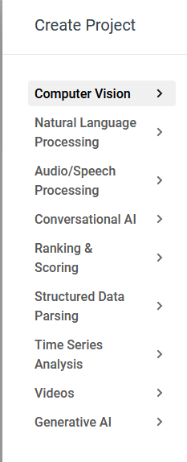

统一下划线命名

crontab备份：

主从库设置：（待）

- **project**

  - [project_ID: 主键]{.underline}

  - project_name

  - project_type: 对应一种机器学习任务 -\> 模型config -\> 数据类型

  - project_description

  - create_time

  - update_time

  - frontend_status: int

[Field \|Type \|Null\|Key\|Default \|Extra \|]{.underline}

[\-\-\-\-\-\-\-\-\-\-\-\-\-\-\-\-\-\--+\-\-\-\-\-\-\-\-\-\-\--+\-\-\--+\-\--+\-\-\-\-\-\-\-\-\-\-\-\-\-\-\-\--+\-\-\-\-\-\-\-\-\-\-\-\-\-\-\-\-\-\-\-\-\-\-\-\-\-\-\-\-\-\-\-\-\-\-\-\-\-\-\-\-\-\-\-\--+]{.underline}

[project_ID \|int \|NO \|PRI\| \|auto_increment \|]{.underline}

[project_name \|varchar(255)\|NO \| \| \| \|]{.underline}

[project_type \|varchar(255)\|YES \| \| \| \|]{.underline}

[project_description\|text \|YES \| \| \| \|]{.underline}

[create_time \|timestamp \|YES \| \|CURRENT_TIMESTAMP\|DEFAULT_GENERATED
\|]{.underline}

[update_time \|timestamp \|YES \| \|CURRENT_TIMESTAMP\|DEFAULT_GENERATED
on update CURRENT_TIMESTAMP\|]{.underline}

> [frontend_status \|int \|YES \| \|1 \| \|]{.underline}

- **model**

  - [model_ID：主键]{.underline}

  - model_version

  - base_model_used: 基座模型名称，例如 UIE-base, ERNIE-large

  - model_description

  - model_status: 描述当前模型是否可以删除

  - create_time

  - training_parameters (dict, can be none)

  - performance_metrics (dict, can be none)

  - is_base: int

  - frontend_status: int

  - [project_ID: 外键]{.underline}

  - [ds_version_ID：外键]{.underline}

[Field \|Type \|Null\|Key\|Default \|Extra \|]{.underline}

[\-\-\-\-\-\-\-\-\-\-\-\-\-\-\-\-\-\--+\-\-\-\-\-\-\-\-\-\-\--+\-\-\--+\-\--+\-\-\-\-\-\-\-\-\-\-\-\-\-\-\-\--+\-\-\-\-\-\-\-\-\-\-\-\-\-\-\-\--+]{.underline}

[model_ID \|int \|NO \|PRI\| \|auto_increment \|]{.underline}

[model_version \|varchar(255)\|NO \| \| \| \|]{.underline}

[base_model_used \|varchar(255)\|YES \| \| \| \|]{.underline}

[model_description \|text \|YES \| \| \| \|]{.underline}

[model_status \|varchar(255)\|YES \| \| \| \|]{.underline}

[create_time \|timestamp \|YES \|
\|CURRENT_TIMESTAMP\|DEFAULT_GENERATED\|]{.underline}

[training_parameters\|json \|YES \| \| \| \|]{.underline}

[performance_metrics\|json \|YES \| \| \| \|]{.underline}

[project_ID \|int \|YES \|MUL\| \| \|]{.underline}

[ds_version_ID \|int \|YES \|MUL\| \| \|]{.underline}

[frontend_status \|int \|YES \| \|1 \| \|]{.underline}

[is_base \|int \|YES \| \| 0 \| \|]{.underline}

- **dataset**

  - [dataset_ID: 主键]{.underline}

  - dataset_name

  - create_time

  - dataset_description

  - create_user

  - dataset_type

  - [project_ID: 外键]{.underline}

  - frontend_status

[Field \|Type \|Null\|Key\|Default \|Extra \|]{.underline}

[\-\-\-\-\-\-\-\-\-\-\-\-\-\-\-\-\-\--+\-\-\-\-\-\-\-\-\-\-\--+\-\-\--+\-\--+\-\-\-\-\-\-\-\-\-\-\-\-\-\-\-\--+\-\-\-\-\-\-\-\-\-\-\-\-\-\-\-\--+]{.underline}

[dataset_ID \|int \|NO \|PRI\| \|auto_increment \|]{.underline}

[dataset_name \|varchar(255)\|NO \| \| \| \|]{.underline}

[create_time \|timestamp \|YES \|
\|CURRENT_TIMESTAMP\|DEFAULT_GENERATED\|]{.underline}

[dataset_description\|text \|YES \| \| \| \|]{.underline}

[create_user \|varchar(255)\|YES \| \| \| \|]{.underline}

[dataset_type \|varchar(255)\|YES \| \| \| \|]{.underline}

[project_ID \|int \|YES \|MUL\| \| \|]{.underline}

[frontend_status \|int \|YES \| \|1 \| \|]{.underline}

- **dataset_version**

  - [ds_version_ID: 主键]{.underline}

  - version_name: 1.0、2.0等名称

  - ds_version_size: 数据数目

  - git_commit_id

  - clean_status：0 or 1

  - label_status: INT, 默认0，其他情况展示已经标注的数据数目

  - modify_status: 0 or 1

  - prediction_status: 0 or 1

  - create_time

  - create_user

  - update_time

  - update_user

  - [dataset_ID: 外键]{.underline}

[Field \|Type \|Null\|Key\|Default \|Extra \|]{.underline}

[\-\-\-\-\-\-\-\-\-\-\-\-\-\-\-\--+\-\-\-\-\-\-\-\-\-\-\--+\-\-\--+\-\--+\-\-\-\-\-\-\-\-\-\-\-\-\-\-\-\--+\-\-\-\-\-\-\-\-\-\-\-\-\-\-\-\-\-\-\-\-\-\-\-\-\-\-\-\-\-\-\-\-\-\-\-\-\-\-\-\-\-\-\-\--+]{.underline}

[ds_version_ID \|int \|NO \|PRI\| \|auto_increment \|]{.underline}

[version_name \|varchar(255)\|NO \| \| \| \|]{.underline}

[ds_version_size \|int \|YES \| \| \| \|]{.underline}

[git_commit_id \|varchar(255)\|YES \| \| \| \|]{.underline}

[clean_status \|int \|YES \| \|0 \| \|]{.underline}

[label_status \|int \|YES \| \|0 \| \|]{.underline}

[modify_status \|int \|YES \| \|0 \| \|]{.underline}

[create_time \|timestamp \|YES \| \|CURRENT_TIMESTAMP\|DEFAULT_GENERATED
\|]{.underline}

[create_user \|varchar(255)\|YES \| \| \| \|]{.underline}

[update_time \|timestamp \|YES \| \|CURRENT_TIMESTAMP\|DEFAULT_GENERATED
on update CURRENT_TIMESTAMP\|]{.underline}

[update_user \|varchar(255)\|YES \| \| \| \|]{.underline}

[dataset_ID \|int \|NO \|MUL\| \| \|]{.underline}

[frontend_status \|int \|YES \| \|1 \| \|]{.underline}

[prediction_status\|int \|YES \| \|0 \| \|]{.underline}

- **task**

  - [task_ID: 主键]{.underline}

  - task_name

  - type: 操作类型，例如清洗、训练等

  - task_status

  - task_result

  - task_description

  - create_time

  - create_user

  - finish_time

  - task_pid

  - base_model_used

  - frontend_status

  - [project_ID：外键]{.underline}

  - [model_ID：外键]{.underline}

  - [ds_version_ID：外键]{.underline}

[Field \|Type \|Null\|Key\|Default \|Extra \|]{.underline}

[\-\-\-\-\-\-\-\-\-\-\-\-\-\-\--+\-\-\-\-\-\-\-\-\-\-\--+\-\-\--+\-\--+\-\-\-\-\-\-\-\-\-\-\-\-\-\-\-\--+\-\-\-\-\-\-\-\-\-\-\-\-\-\-\-\--+]{.underline}

[task_ID \|int \|NO \|PRI\| \|auto_increment \|]{.underline}

[task_name \|varchar(255)\|NO \| \| \| \|]{.underline}

[type \|varchar(255)\|YES \| \| \| \|]{.underline}

[task_status \|varchar(255)\|YES \| \| \| \|]{.underline}

[create_time \|timestamp \|YES \|
\|CURRENT_TIMESTAMP\|DEFAULT_GENERATED\|]{.underline}

[create_user \|varchar(255)\|YES \| \| \| \|]{.underline}

[finish_time \|timestamp \|YES \| \| \| \|]{.underline}

[project_ID \|int \|YES \|MUL\| \| \|]{.underline}

[model_ID \|int \|YES \|MUL\| \| \|]{.underline}

[ds_version_ID \|int \|YES \|MUL\| \| \|]{.underline}

[frontend_status \|int \|YES \| \|1 \| \|]{.underline}

[task_description\|varchar(100)\|YES \| \| \| \|]{.underline}

[task_pid \|varchar(100)\|YES \| \| \| \|]{.underline}

[base_model_used \|varchar(100)\|YES \| \| \| \|]{.underline}

[task_result \|varchar(100)\|YES \| \| \| \|]{.underline}

- **user**

  - user_ID

  - user_name

  - user_role

  - create_time

  - last_login_time

+\-\-\-\-\-\-\-\-\-\-\-\-\-\-\-\--+\-\-\-\-\-\-\-\-\-\-\-\-\--+\-\-\-\-\--+\-\-\-\--+\-\-\-\-\-\-\-\-\-\-\-\-\-\-\-\-\-\--+\-\-\-\-\-\-\-\-\-\-\-\-\-\-\-\-\-\--+

\| Field \| Type \| Null \| Key \| Default \| Extra \|

+\-\-\-\-\-\-\-\-\-\-\-\-\-\-\-\--+\-\-\-\-\-\-\-\-\-\-\-\-\--+\-\-\-\-\--+\-\-\-\--+\-\-\-\-\-\-\-\-\-\-\-\-\-\-\-\-\-\--+\-\-\-\-\-\-\-\-\-\-\-\-\-\-\-\-\-\--+

\| user_ID \| int \| NO \| PRI \| NULL \| \|

\| user_name \| varchar(255) \| NO \| \| NULL \| \|

\| user_role \| varchar(255) \| YES \| \| NULL \| \|

\| create_time \| timestamp \| YES \| \| CURRENT_TIMESTAMP \|
DEFAULT_GENERATED \|

\| last_login_time \| timestamp \| YES \| \| NULL \| \|

+\-\-\-\-\-\-\-\-\-\-\-\-\-\-\-\--+\-\-\-\-\-\-\-\-\-\-\-\-\--+\-\-\-\-\--+\-\-\-\--+\-\-\-\-\-\-\-\-\-\-\-\-\-\-\-\-\-\--+\-\-\-\-\-\-\-\-\-\-\-\-\-\-\-\-\-\--+

- **deployment**

  - deployment_ID

  - deployment_name

  - [model_ID]{.underline} : foreign key

  - deployment_status

  - create_time

  - update_time

  - endpoint

[Field \|Type \|Null\|Key\|Default \|Extra \|]{.underline}

[\-\-\-\-\-\-\-\-\-\-\-\-\-\-\-\--+\-\-\-\-\-\-\-\-\-\-\--+\-\-\--+\-\--+\-\-\-\-\-\-\-\-\-\-\-\-\-\-\-\--+\-\-\-\-\-\-\-\-\-\-\-\-\-\-\-\-\-\-\-\-\-\-\-\-\-\-\-\-\-\-\-\-\-\-\-\-\-\-\-\-\-\-\-\--+]{.underline}

[deployment_ID \|int \|NO \|PRI\| \|auto_increment \|]{.underline}

[deployment_name \|varchar(255)\|NO \| \| \| \|]{.underline}

[model_ID \|int \|YES \|MUL\| \| \|]{.underline}

[deployment_status\|varchar(255)\|YES \| \| \| \|]{.underline}

[create_time \|timestamp \|YES \| \|CURRENT_TIMESTAMP\|DEFAULT_GENERATED
\|]{.underline}

[update_time \|timestamp \|YES \| \|CURRENT_TIMESTAMP\|DEFAULT_GENERATED
on update CURRENT_TIMESTAMP\|]{.underline}

[endpoint \|varchar(255)\|YES \| \| \| \|]{.underline}

- labeling_task

  - ID主键

  - [ds_version_ID 外键]{.underline}

  - ls_project_name: label-studio中的project名称

  - labeling_status

  - create_time

  - last_export_time

  - user

  - ls_project_ID: label-studio中的project id

[Field \|Type \|Null\|Key\|Default \|Extra \|]{.underline}

[\-\-\-\-\-\-\-\-\-\-\-\-\-\-\--+\-\-\-\-\-\-\-\-\-\-\--+\-\-\--+\-\--+\-\-\-\-\-\-\-\-\-\-\-\-\-\-\-\--+\-\-\-\-\-\-\-\-\-\-\-\-\-\-\-\--+]{.underline}

[ID \|int \|NO \|PRI\| \|auto_increment \|]{.underline}

[ds_version_ID \|int \|YES \|MUL\| \| \|]{.underline}

[ls_project_name \|varchar(255)\|YES \| \| \| \|]{.underline}

[labeling_status \|varchar(255)\|YES \| \|1 \| \|]{.underline}

[create_time \|timestamp \|YES \|
\|CURRENT_TIMESTAMP\|DEFAULT_GENERATED\|]{.underline}

[last_export_time\|timestamp \|YES \| \| \| \|]{.underline}

[user \|varchar(255)\|YES \| \| \| \|]{.underline}

[ls_project_ID \|int \|YES \| \| \| \|]{.underline}

增加表

+\-\-\-\-\-\-\-\-\-\-\-\-\-\-\-\-\-\--+\-\-\-\-\-\-\-\-\-\-\-\-\--+\-\-\-\-\--+\-\-\-\--+\-\-\-\-\-\-\-\-\-\-\-\-\-\-\-\-\-\--+\-\-\-\-\-\-\-\-\-\-\-\-\-\-\-\-\-\-\-\-\-\-\-\-\-\-\-\-\-\-\-\-\-\-\-\-\-\-\-\-\-\-\-\-\-\--+

dim_project_type

预设置几个项目类型 项目类型对应的数据类型

{width="2.4270833333333335in"
height="5.979166666666667in"}

project_type_mode

每种project_type对应使用的默认的model id
