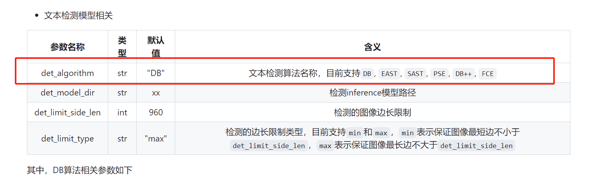

ocr找品牌项目的两个步骤：

1.  OCR：ocr模型不动，提高输入的质量

2.  NER：强化模型性能

## ocr置信度

a.  去除无文字的图片：*NER会从底部生产厂家（公司名）中获取一个品牌*

b.  根据置信度来过滤：

    i.  上1/3部分所有文字的置信度：错杀太多

    ii. 全图置信度：同上

c.  "品牌"部分置信度过滤：

    i.  需要NER支持

## 

## 训练目标检测模型

目标检测模型：1)直接框出品牌区域 2)根据bounding box坐标抠出品牌区域
3)ocr预测

- 教程文档：

[ppyoloe模型](https://github.com/PaddlePaddle/PaddleDetection/blob/release/2.7/configs/ppyoloe/README_cn.md)

[COCO数据集格式](https://github.com/PaddlePaddle/PaddleDetection/blob/release/2.7/docs/tutorials/data/PrepareDetDataSet.md#COCO%E6%95%B0%E6%8D%AE)

- 训练相关的数据集目录：[10.6.10.53:8888/tree/data-new/yangzihao/OCR/brand-det/dataset](http://10.6.10.53:8888/tree/data-new/yangzihao/OCR/brand-det/dataset)

train/: 训练样本，图片

valid/: 验证样本，图片

test/: 空目录，需要保留

coco_train.json: 训练集的标注

coco_valid.json: 验证集的标注

- 配置文件：

  - 模型配置：[ppyoloe_plus_crn_x_80e_coco.yml](http://10.6.10.53:8888/edit/data-new/yangzihao/OCR/PaddleDetection/configs/ppyoloe/ppyoloe_plus_crn_x_80e_coco.yml)

  - 数据集配置：[coco_detection.yml](http://10.6.10.53:8888/edit/data-new/yangzihao/OCR/PaddleDetection/configs/datasets/coco_detection.yml)

  - 训练超参数配置：[optimizer_80e.yml](http://10.6.10.53:8888/edit/data-new/yangzihao/OCR/PaddleDetection/configs/ppyoloe/_base_/optimizer_80e.yml)
    （原80epochs改为了40epochs）

- 训练完成后的模型导出目录：

<http://10.6.10.53:8888/tree/data-new/yangzihao/OCR/PaddleDetection/output>

名称叫做：ppyoloe_plus_crn_x_80e_coco

## 尝试将OCR环节det_model替换为训练后的ppyoloe，无效

OCR的检测模型能支持的模型有限

{width="6.299305555555556in"
height="1.8558978565179352in"}
