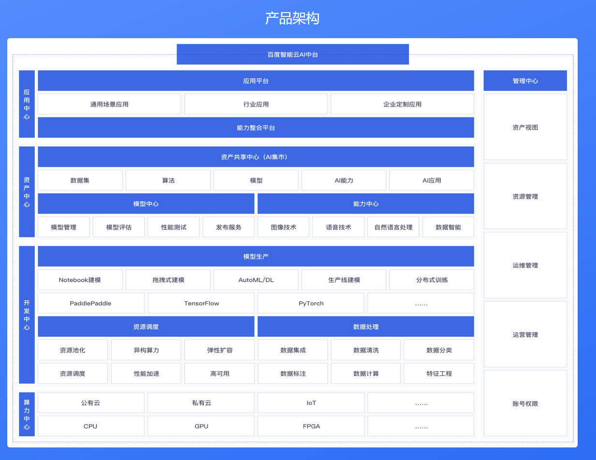
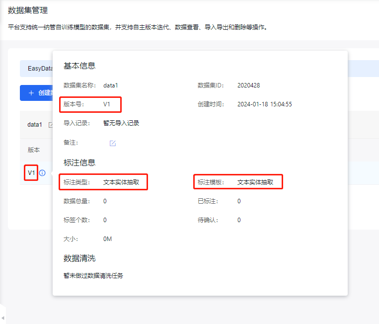
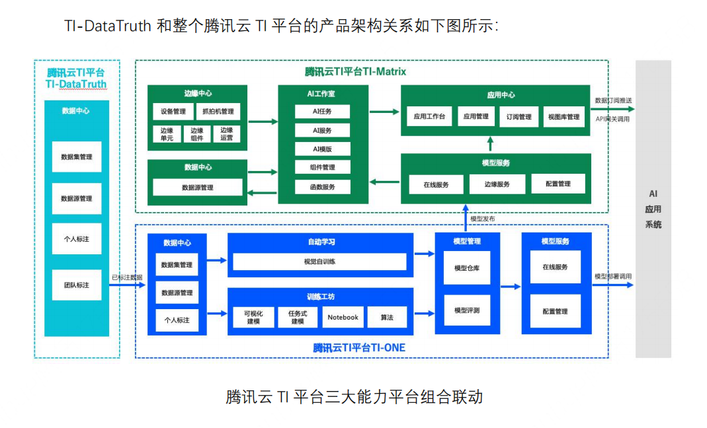
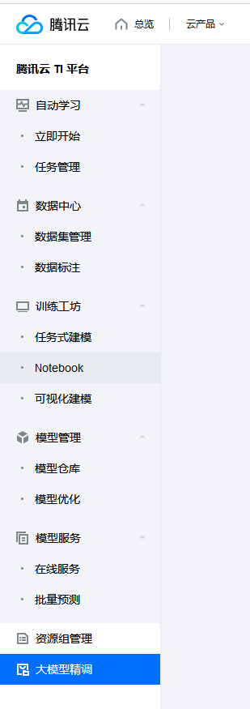
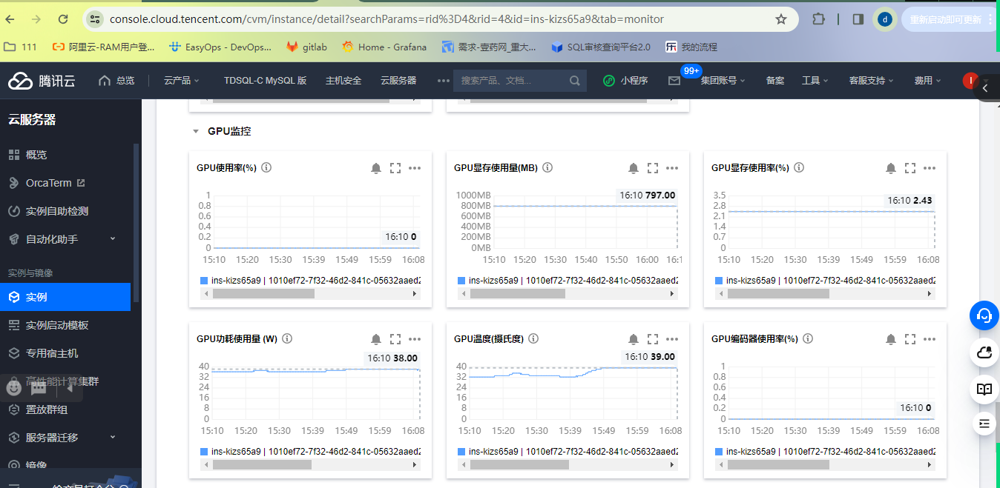
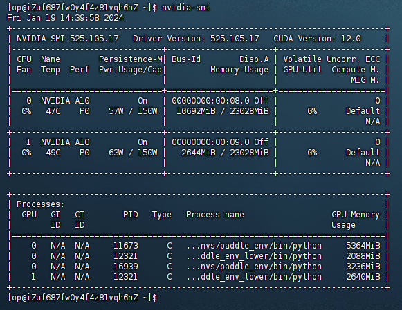

目的：提供开源模型微调功能，每个人为自己训练独有的定制的模型，固化模型功能，提高模型的性能和准确度。

{width="6.299305555555556in"
height="4.86369750656168in"}

[项目开发进度跟踪表](https://doc.weixin.qq.com/sheet/e3_AMsAlQbuAEoXz2YyUVKS02qHDw1m9?scode=AEQA-QfUAA0xBd0iYtAMsAlQbuAEo&tab=z58tgp)

## 整体系统结构

<https://modao.cc/community/mtl8if7rutflvq55?title=%E5%85%A8%E6%B5%81%E7%A8%8Bai%E5%BC%80%E5%8F%91%E5%B9%B3%E5%8F%B0>

{width="6.299407261592301in"
height="4.1996052055993in"}

产品原型图

[ai平台建设产品原型](https://doc.weixin.qq.com/doc/w3_AMsAlQbuAEoCUSDqF0ERW2Rt9oP1A?scode=AEQA-QfUAA0EjLKQaWAMsAlQbuAEo)

内测

[ai平台使用问题汇总](https://doc.weixin.qq.com/sheet/e3_AMsAlQbuAEoF70BE0uEQy0gMIOxVZ?scode=AEQA-QfUAA0uz6bU1ZAMsAlQbuAEo&tab=BB08J2)

使用说明书

## 数据管理及数据标注调研 \@杨子豪

调研详细版本：[数据管理&标注系统功能调研](https://doc.weixin.qq.com/sheet/e3_AT0AdAbcAO8KJlFkPa6SeefXj2gBH?scode=AEQA-QfUAA0pm5aQM3AT0AdAbcAO8)

  ----------- ---------------------------------- ------------------------------------- --------------------------- --------------------------------------------
  功能点      **doccano**                        **label studio**                      **腾讯TI-data**             **百度EasyData**

  流程指导    项目主要有每项功能的操作使用视频   每个project的设置中需要自己配置说明   页面中有操作指南文档入口    每个子项顶部都有功能描述，流程，和使用说明

  智能打标    配置API，在标注时手动开启          配置API，可设置增加数据时自动预标注   仅在OCR任务标注时提供模型   已经提供模型

  项目管理    一个项目一份数据                   一个项目一份数据                      数据集可按版本进行管理      资源管理和权限管理

  数据管理    只有导入导出功能                   只有导入导出功能                      可在COS内操作               根据数据集管理

  数据回流    数据导入导出                       可配置本地/云端数据库，进行自动同步   无                          可配置云服务器

  数据清洗    无                                 无                                    无                          根据任务性质展示不同数据处理功能
  ----------- ---------------------------------- ------------------------------------- --------------------------- --------------------------------------------

doccano使用者提的需求：

[打标系统需求](https://doc.weixin.qq.com/sheet/e3_APAAWAb1AEod5yi2UaVSZO9rJAqCk?scode=AEQA-QfUAA0QsgWDrXAMsAlQbuAEo&tab=BB08J2)

doccano调用：

[doccano的安装和接口调用](https://doc.weixin.qq.com/doc/w3_AMsAlQbuAEo9dGEnGIzTqCZ11OWQW?scode=AEQA-QfUAA0HaRe36iAMsAlQbuAEo)

- 数据集管理

  - 数据集版本控制

  - 数据集类型与模型关系

> {width="6.299305555555556in"
> height="5.382892607174103in"}

**一期开发功能点：**

- 数据集合并

- 数据对比

- 简单的数据清洗

- 数据集版本管理

## AI开发核心流程调研

- 离线训练流程：

{width="6.299407261592301in"
height="3.1497036307961506in"}

- 各开源工具流程功能对比：

[TI-ONE平台数据中心调研](https://doc.weixin.qq.com/doc/w3_AT0AdAbcAO8HfTnK4c0Qxu1e2spYR?scode=AEQA-QfUAA01PwEzrvAMsAlQbuAEo)

[腾讯云TI-ONE大模型微调](https://doc.weixin.qq.com/doc/w3_AecAhwbqAOoArtqslC0Q40uKGM7vZ?scode=AEQA-QfUAA0OuquGkcAMsAlQbuAEo)

- 腾讯TI-ONE架构图{width="10.625in"
  height="6.440598206474191in"}

- TI-ONE训练平台核心功能

{width="3.21875in"
height="9.114583333333334in"}

**一期开发功能点：**

无

## 模型管理 \@侯庆

- 代码管理

> [任务-模型管理前端逻辑](https://doc.weixin.qq.com/doc/w3_AecAhwbqAOowz74A84VRguVZJgXlM?scode=AEQA-QfUAA016CIhsvAecAhwbqAOo)

## 推理服务

[腾讯云TI-ONE部署调研](https://doc.weixin.qq.com/doc/w3_AD8ARwY0AEw8K97GIEnRA0i5kW0h0?scode=AEQA-QfUAA0SMP1Yz0AMsAlQbuAEo)

现在已经实现自动化部署：

[GPU迁移与实现自动化部署](https://doc.weixin.qq.com/doc/w3_AD8ARwY0AEwVDpcXln0TpuQKhLqKu?scode=AEQA-QfUAA0hbmO8z3AMsAlQbuAEo)

已提供服务：

[算法服务及接口使用情况](https://doc.weixin.qq.com/doc/w3_AD8ARwY0AEwhRKA5AXGSBqFcoVjVn?scode=AEQA-QfUAA0PrRYh8NAMsAlQbuAEo)

服务隔离

[使用docker进行算法服务隔离](https://doc.weixin.qq.com/doc/w3_AMsAlQbuAEoOwCKMlTCTTWlh0Omk3?scode=AEQA-QfUAA0aX1b7k5AMsAlQbuAEo)

**一期开发功能点：**

无

## 算力中心

- 部署服务列表

- 内存使用详情

> 腾讯云只显示GPU使用率，无法知道部署的应用及对应的内存占用情况，只可作为异常监控告警用
>
> {width="5.760416666666667in"
> height="2.8161089238845145in"}
>
> 系统显示每个进程及内存使用，但是无法与具体的推理服务对应
>
> {width="6.052083333333333in"
> height="4.677083333333333in"}

- GPU资源@侯庆

[算法模型使用汇总](https://doc.weixin.qq.com/doc/w3_AecAhwbqAOoLi2n0721RH2waADjI8?scode=AEQA-QfUAA0bbgErfdAMsAlQbuAEo)

  ------------- ------------- ------------- ------------- ----------------------
  机器          模型/工具     训练          推理          功能（是否正式服务）

  A100          ChatGLM                                   素材过滤（是）

  A100          百川                                      素材过滤（否）

                                                          

                stable                                    
                diffusion                                 

  汇总                                                    
  ------------- ------------- ------------- ------------- ----------------------

## 咨询中心（二期规划）

- 接入GPT机器人

> 提供将业务问题转变成算法任务的解决方案

- 打标系统的使用及如何有效的打标

- 如何快速开发部署算法服务

> [算法服务部署流程](https://doc.weixin.qq.com/doc/w3_AMsAlQbuAEoxLSwsAQlSvS2hMk6Fs?scode=AEQA-QfUAA0rPiv2tXAMsAlQbuAEo)
