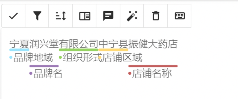
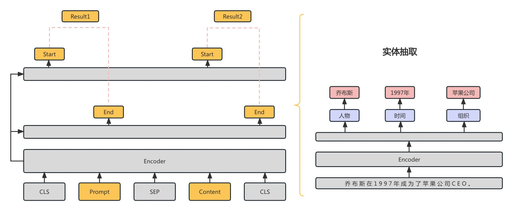
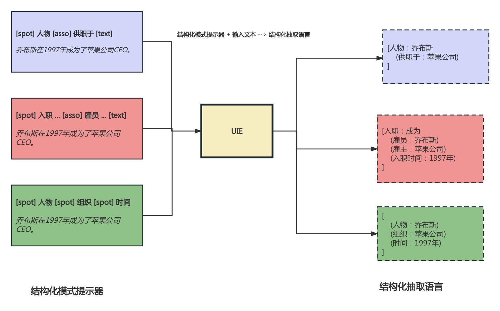
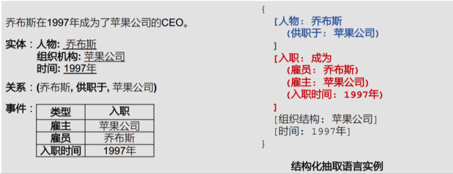
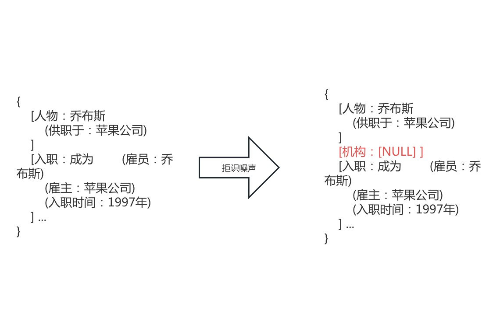
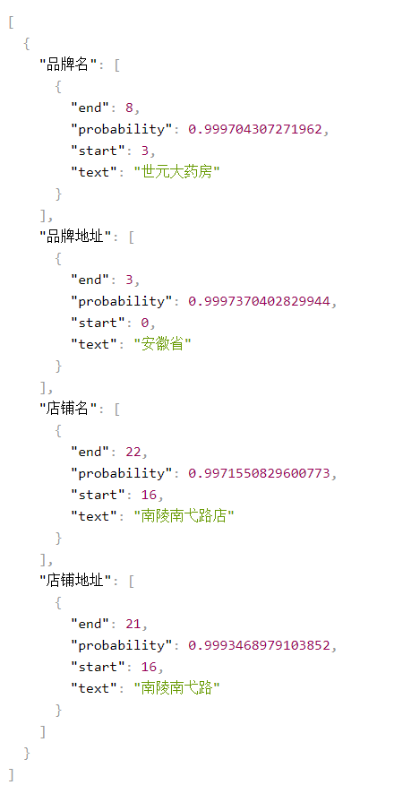
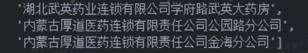
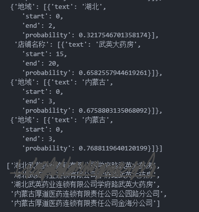
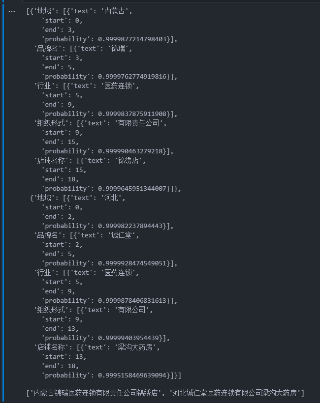
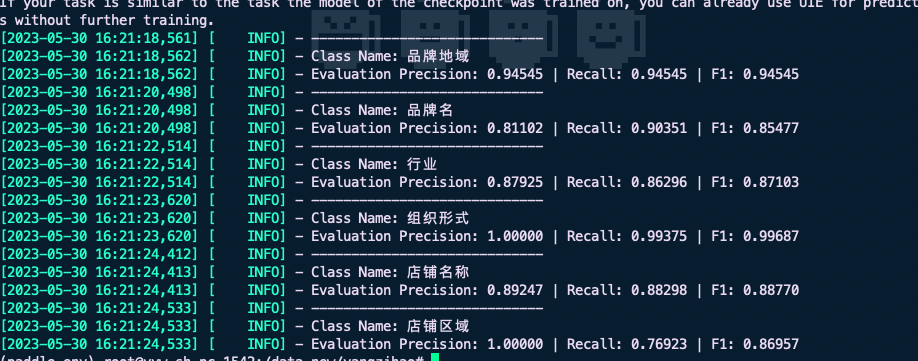

## 实体类型定义

一个标准终端名称由两个主体部分组成：**品牌公司** + **分店信息**

对于品牌公司部分的实体规则设定参照相关法律文件中的规则，将其分为：

**品牌地域、品牌名、行业、组织形式**

而对分店信息通常可能包含两个部分：

**店铺区域、店铺名称**

在对码的处理过程中，我们将一个输入的终端名称及其ES（Elasticsearch）召回的结果进行拆分，分成六个实体要素，并逐一送入匹配环节进行匹配，并根据对应实体类别一一匹配赋予其相应得分。最终，通过综合考量两个终端的匹配得分，得出最终的匹配结果。

## 数据标注

使用开源的标注系统**Doccano**对训练数据进行标注。对于每条终端数据，按照既定的实体规则进行数据标注。

导出的数据含[样本id]{.underline}、[原始文本text]{.underline}、以及每个实体部分的[标注label]{.underline}和其[开始及结束index]{.underline}

其格式为：

{

\"id\":1,

\"text\":\"邓州市医药有限公司第一百八十六药店\",

\"label\":\[\[0,3,\"品牌地域\"\], \[3,5,\"行业\"\],
\[5,9,\"组织形式\"\], \[9,17,\"店铺名称\"\]\]

}

doccano系统标注界面：

{width="5.010416666666667in"
height="2.09375in"}

[GitHub - doccano/doccano: Open source annotation tool for machine
learning practitioners.](https://github.com/doccano/doccano)

## 模型架构：UIE框架

**UIE**(Universal Information Extraction)：Yaojie
Lu等人在ACL-2022中提出了通用信息抽取统一框架[UIE]{.underline}。该框架实现了[实体抽取]{.underline}、[关系抽取]{.underline}、[事件抽取]{.underline}、[情感分析]{.underline}等任务的统一建模，并使得不同任务间具备良好的迁移和泛化能力。

该模型可以支持不限定行业领域和抽取目标的关键信息抽取，实现零样本快速冷启动，并具备优秀的小样本微调能力，快速适配特定的抽取目标。

{width="6.299305555555556in"
height="2.606487314085739in"}

UIE旨在通过单一框架统一建模不同IE任务的文本到结构的转换，也就是：不同的结构转换共享模型中
**相同的底层操作** 和 **不同的转换能力**。

具体来说，UIE：

- 通过**结构化抽取语言**对不同的信息抽取目标结构进行统一编码；

<!-- -->

- 通过**结构化模式提示器**自适应生成目标结构；

<!-- -->

- 通过大规模结构化/非结构化数据进行模型预训练捕获常见的IE能力；

### **UIE的整体框架：**

设计**结构化抽取语言**（SEL，Structured Extraction
Language）来统一编码异构提取结构，即编码实体、关系、事件统一表示。

构建**结构化模式提示器**（SSI，Structural Schema
Instructor），一个基于schema的prompt机制，用于控制不同的生成需求。

{width="6.299305555555556in"
height="3.922784339457568in"}

简单概括：**SSI**就是输入特定抽取任务的schema，**SEL**就是把不同任务的抽取结果统一用1种语言表示。

#### 

#### **SEL**

SEL语言可以统一用

（

Spot Name：Info Span

（Asso Name：Info Span）

（Asso Name：Info Span）

\...）形式表示，具体地：

Spot Name：Spotting操作的Info Span的类别信息，如实体类型；

Asso Name: Associating操作的Info Span的类别信息，如关系类型、事件类型；

Info Span：Spotting或Associating操作相关的文本Span；

{width="6.299305555555556in"
height="2.4298326771653542in"}

#### **SSI**

SSI的本质一个基于schema的prompt机制，用于控制不同的生成需求：在Text前拼接上相应的Schema
Prompt，输出相应的SEL结构语言。

不同任务的的形式是：

**实体抽取**：\[spot\] 实体类别 \[text\]

**关系抽取**：\[spot\] 实体类别 \[asso\] 关系类别 \[text\]

**事件抽取**：\[spot\] 事件类别 \[asso\] 论元类别 \[text\]

**观点抽取**：\[spot\] 评价维度 \[asso\] 观点类别 \[text\]

## 

## 预训练

UIE框架基于开源模型**T5-v1.1-base**实现，在其预训练参数的基础上进行二次预训练，以实现在下游任务上取得出色的效果。

使用**终端名称（药店、企业、医疗机构）、商品、合同文件**作为预训练语料，构建3种预训练数据：

Data_pair: 构建text-to-struct的平行语料：（SSI，Text，SEL）

Data_record: 构造只包含SEL语法结构化record数据：（None，None，SEL）

Data_text: 构造无结构的原始文本数据：（None，Text\'，Text\'\'）

针对上述数据，分别构造3种预训练任务，将大规模异构数据整合到一起进行预训练：

**Text-to-Structure
Pre-training**：为了构建基础的文本到结构的映射能力，对平行语料Data_pair训练，同时构建负样本作为噪声训练（引入negative
schema）。

**Structure Generation
Pre-training**：为了具备SEL语言的结构化能力，对Data_pair数据只训练 UIE
的 decoder 部分。

**Retrofitting Semantic
Representation**：为了具备基础的语义编码能力，对Data_text数据进行 span
corruption训练。(可以理解为Masked-Language Modeling任务)

## 微调

在微调环节中加入**拒识噪声注入的模型微调机制**，随机采样SEL中不存在的SpotName类别和AssoName类别，即：(SPOTNAME,
\[NULL\]) 和 (ASSONAME,
\[NULL\])，使得模型学会**拒绝生成错误结果的能力**

如图：

{width="6.2575656167979in"
height="2.553556430446194in"}

## 投入生产环节

1.  分词规则设定为：[品牌名、品牌地址；店铺名、店铺地址]{.underline}。

随机抽样20条数据，抽取实体测试效果。结果显示效果较好，且置信度高。 5/9

{width="3.6041666666666665in"
height="5.558634076990376in"}

2.  针对对码项目会议讨论的分词规则，对微调数据进行重新标注。分词规则调整为：

**品牌区域； 品牌名； 行业词； 组织形式； 店铺区域； 店铺名称；**

3.  调整标注后的数据微调uie-base，效果不佳。5/11

{width="5.46875in"
height="0.9479166666666666in"}

{width="4.206101268591426in"
height="3.322544838145232in"}

可能的原因：

a.  标注不够精确

b.  基线模型能力不足

c.  数据量不够

<!-- -->

4.  子龙用jieba分词工具生成1w条标注数据，对uie-base做fine
    tune。效果显著，且置信度高

{width="4.878941382327209in"
height="6.15494750656168in"}

## 后续优化

- 提升推理速度，视情况调整以下参数：

  - batch size: 32/ 64/ 128

  - precision：单精度或双精度

  - use_fast：FastTokenizer工具加速预处理

> 真实使用场景在50条左右，bs设为64，开启单精度和FastTokenizer，1s左右

- 对训练数据进行细致的预处理，以及根据标注进行精准校对。添加更多数据，打散重组对UIE-base模型进行重新训练。

模型精度展示如下图：

{width="6.5649453193350835in"
height="2.5816786964129483in"}
