## 新机器部署方式

## finetune

## 已经部署的服务

## 实体识别自动化使用步骤

<http://10.6.10.52:8008/>

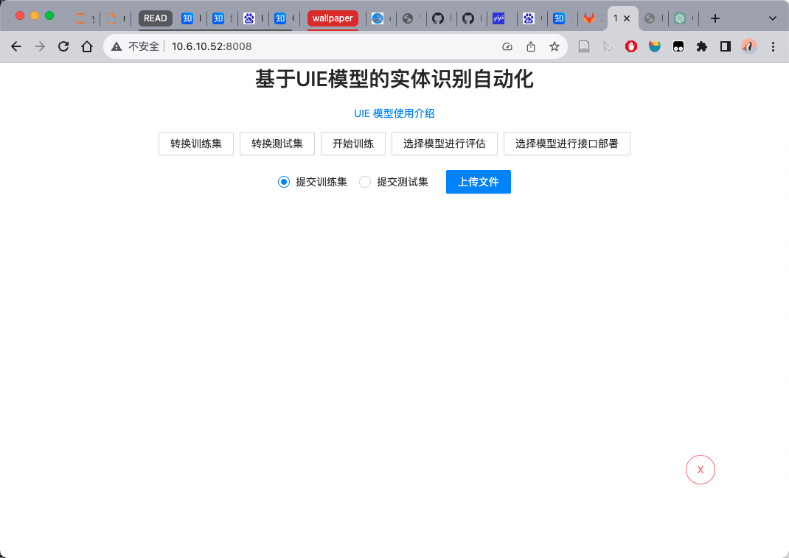{width="5.09375in"
height="3.40505905511811in"}

### 使用方法：

1.  先在**doccano**标注系统中，进行**数据标注**。参考：<https://github.com/PaddlePaddle/PaddleNLP/blob/develop/model_zoo/uie/doccano.md>

> [对码规格任务训练集：]{.underline}
>
> 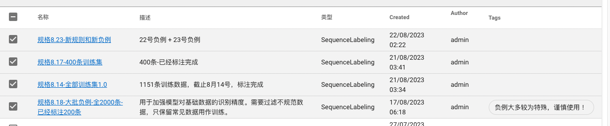{width="6.065972222222222in"
> height="1.2569553805774278in"}
>
> [对码终端任务训练集：]{.underline}
>
> 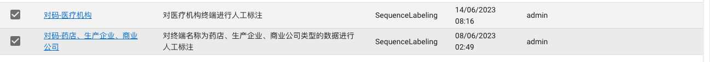{width="6.065972222222222in"
> height="0.5374321959755031in"}

2.  导出带有标注的数据，后缀名为\`.jsonl\`。**进行数据集上传：**

> 然后选择上传的类型：上传训练集 / 上传测试集进行数据集上传：
>
> 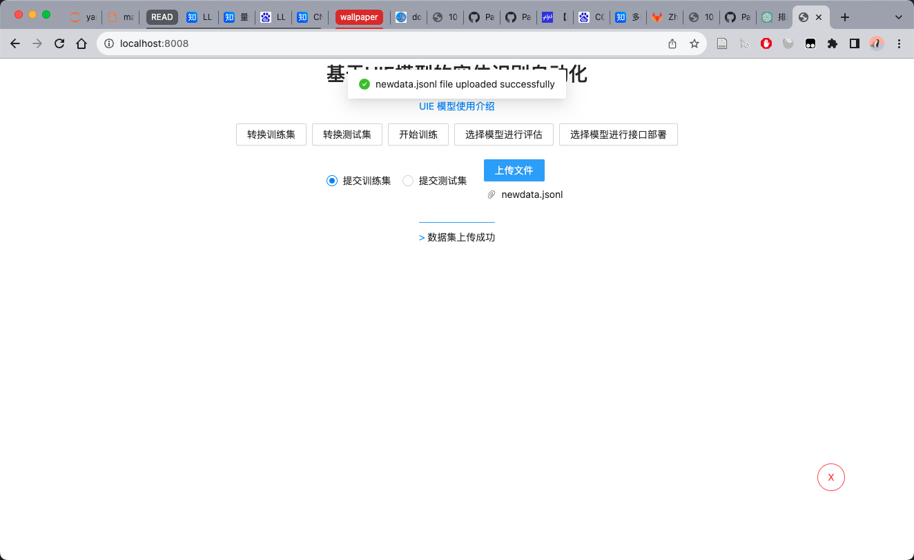{width="6.020833333333333in"
> height="1.5050349956255469in"}

3.  点击**转换数据集**，选择对应的按钮，出现下图字样即为转换成功。

> 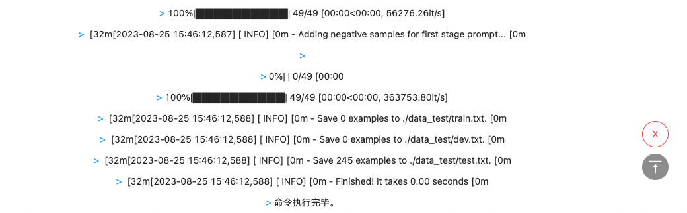{width="6.065972222222222in"
> height="1.8897834645669291in"}

4.  点击**开始训练**，训练中的输出将会显示在页面上。包括**模型配置**、**训练进度**、**中间验证步骤的评估得分、模型保存路径**。

> [训练进度]{.underline}
>
> 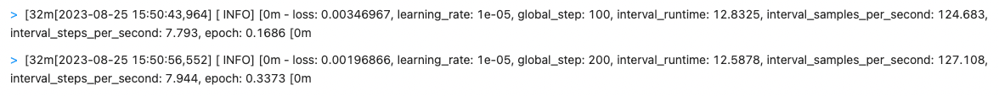{width="6.065972222222222in"
> height="0.5880282152230971in"}
>
> [验证阶段的评估得分]{.underline}
>
> 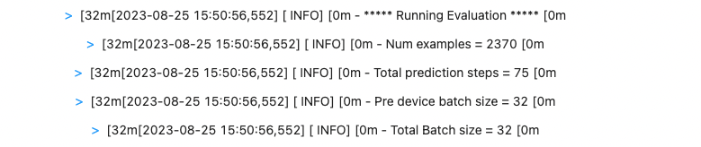{width="6.065972222222222in"
> height="1.2770472440944882in"}
>
> [模型保存路径]{.underline}
>
> 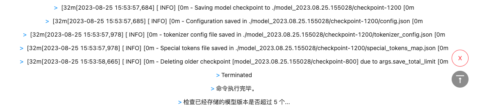{width="6.065972222222222in"
> height="1.3351443569553805in"}
>
> **在训练完成后，会检查本地模型版本个数，超过5个时，会自动删除最旧版本。**

5.  点击**选择模型进行评估**按钮、**选择模型进行部署**，会将当前本地已经保存的模型展示，选择某个模型进行相应操作。

> [对测试集进行验证，评估得分]{.underline}
>
> 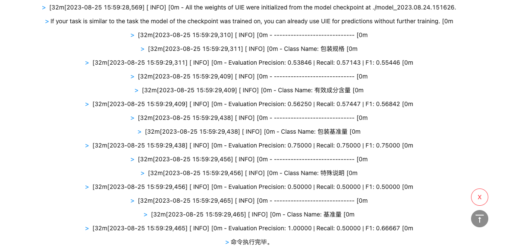{width="6.065972222222222in"
> height="2.9558759842519686in"}

6.  在将模型部署成功之后，调用http接口得到模型推理结果：

> （注意nginx服务是否正常，否则使用 url =
> \'http://10.6.10.52:19999/extract\'）
>
> 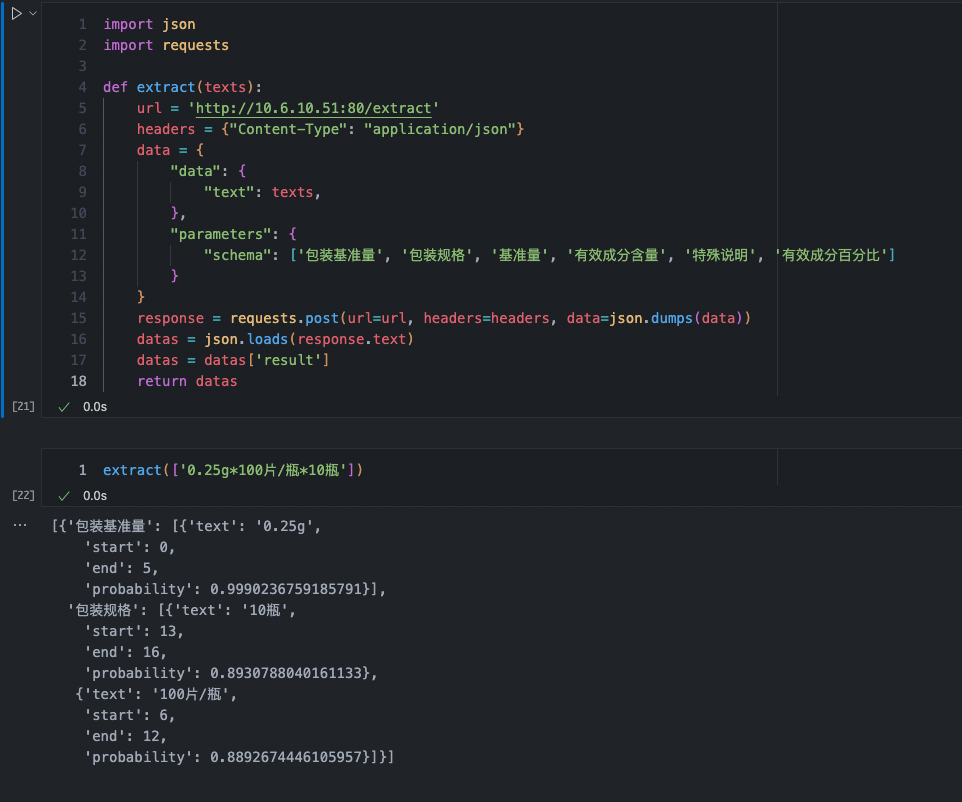{width="6.065972222222222in"
> height="5.05707895888014in"}

## 性能优化

## UIE Slim 数据蒸馏

<https://github.com/tianbuwei/PaddleNLP/blob/363269affb0981c753288fb5595892597425d492/model_zoo/uie/data_distill/README.md>

服务调用：

> 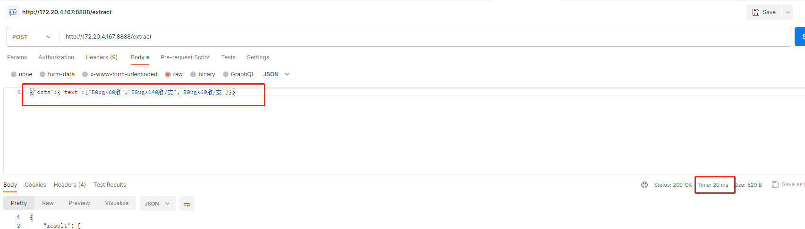{width="6.065972222222222in"
> height="1.7326268591426073in"}

效果评估：

蒸馏模型：

{width="6.299305555555556in"
height="0.3420439632545932in"}

finetune模型：

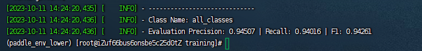{width="6.299305555555556in"
height="0.7646555118110236in"}

Precision: 94.507%-\>93.478%

Recall: 94.016%-\>93.235%

F1:94.261%-\>93.356%

> 知识蒸馏（knowledge
> distillation）核心思想：**好模型的目标不是拟合训练数据，而是学习如何泛化到新的数据。所以蒸馏目标是**学生模型学习到教师模型的泛化能力，比单纯拟合训练数据得到的学生模型要好
>
> 教师模型输出概率，学生模型的目标是尽可能拟合教师模型的输出
>
> 蒸馏的提升：
>
> 一方面来源于从**精调阶段蒸馏-\>预训练阶段蒸馏**
>
> 另一方面则来源于**蒸馏最后一层知识-\>蒸馏隐层知识-\>蒸馏注意力矩阵**
>
> 三种不同的蒸馏策略：
>
> 直接蒸馏所有层
>
> 先蒸馏中间层再蒸馏最后一层
>
> 逐层蒸馏

- 支持在 teacher 网络和 student 网络任意层添加组合 loss

  - 支持 FSP loss

  - 支持 L2 loss

  - 支持 softmax with cross-entropy loss

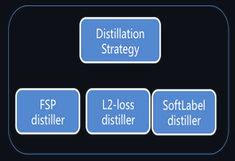{width="2.75in"
height="1.8854166666666667in"}

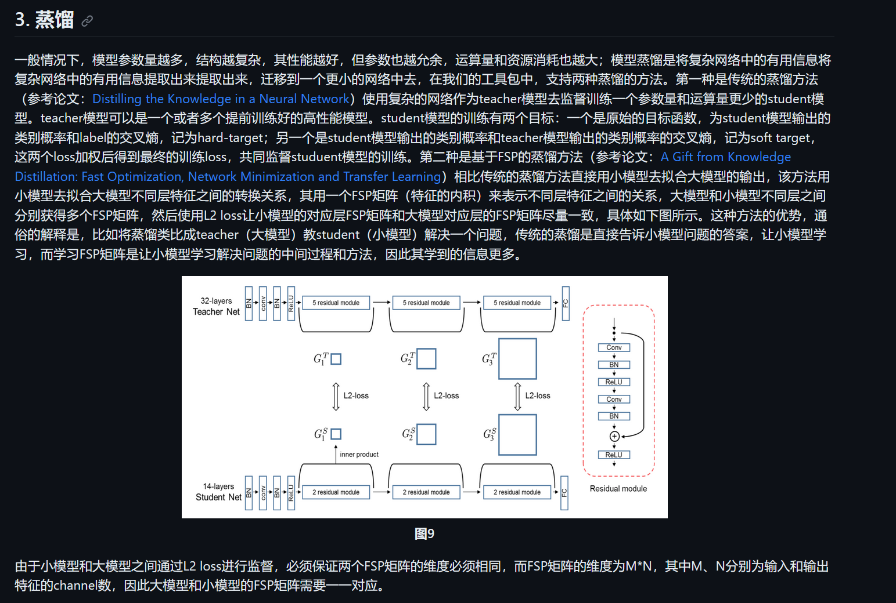{width="6.299305555555556in"
height="4.2458048993875765in"}

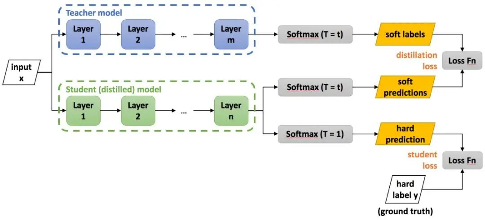{width="6.299305555555556in"
height="2.86968394575678in"}
