# BI产品的发展趋势

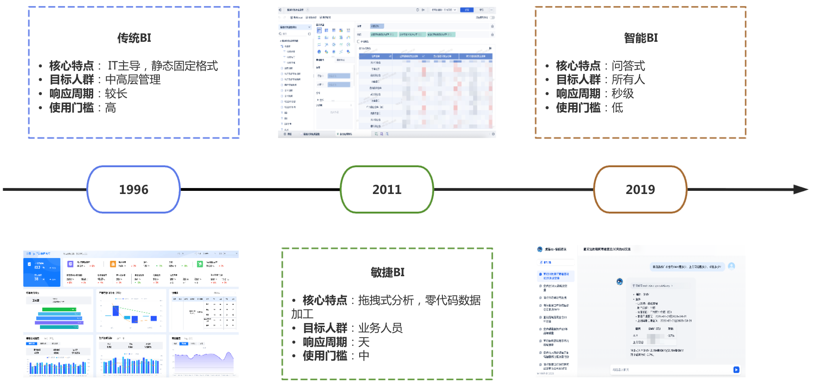{width="9.447916666666666in"
height="4.507554680664917in"}

####  **一、传统BI阶段（1996年-2010年）** 

1996年由Gartner首次提出概念，至2010年前后逐渐成熟。

**核心特点** ：

- **技术主导**
  ：以IT部门为中心，基于预定义的多维数据集（Cube）构建报表，主要服务于管理层，提供静态的、固定格式的分析结果。

- **技术基础** ：依赖数据仓库、ETL工具（如IBM Cognos、Oracle BI
  EE）和复杂SQL查询，需专业开发人员编写代码。

- **应用场景**
  ：适用于结构化数据的高效查询，例如财务报表、销售统计等标准化需求。

**优点** ：

1.  查询性能高（预计算Cube减少实时计算压力）。

2.  适合大规模企业级数据整合，确保数据一致性。

**缺点** ：

1.  **灵活性差** ：需求变更需重新开发Cube，响应周期长达数周甚至数月。

2.  **数据冗余** ：Cube的维度组合导致存储资源消耗大。

3.  **用户门槛高** ：仅限技术人员使用，业务人员被动接受结果。

####  **二、敏捷BI阶段（2011年-2018年）** 

2011年Tableau、Power
BI等工具兴起，2013年后国内厂商（如帆软、永洪BI）崛起。

**核心特点** ：

- **业务主导**
  ：以"自助分析"为核心，业务人员通过拖拽式界面直接操作数据，支持实时交互和多维分析。

- **技术升级**
  ：基于内存计算（如QlikView）、可视化引擎（如Tableau），无需预计算Cube，直接从数据仓库提取数据。

- **应用场景** ：零售销售趋势分析、营销活动效果追踪等动态需求。

**优点** ：

1.  **响应快** ：业务人员可自主调整分析维度和指标，缩短决策链路。

2.  **灵活性高** ：支持实时数据更新和交互式探索。

3.  **降低IT依赖** ：通过可视化界面降低技术门槛。

**缺点** ：

1.  **长尾数据处理难** ：复杂计算（如归因分析）仍需IT支持。

2.  **知识沉淀不足** ：分析经验难以形成标准化模板，复用性低。

3.  **数据治理挑战** ：业务人员操作可能导致数据口径混乱。

####  **三、智能BI阶段（2019年至今）** 

2019年AI技术加速渗透，2024年后AI大模型（如DeepSeek、ChatBI）推动智能分析普及。

**核心特点** ：

- **AI驱动**
  ：整合自然语言处理（NLQ/NLG）、机器学习（AutoML）和预测性分析，实现"对话式BI"。

- **零代码化**
  ：业务人员通过自然语言提问（如"显示华东区毛利率趋势"）直接获取分析结果。

- **全流程增强**
  ：从数据清洗到报告生成均由AI辅助，例如自动识别数据异常、推荐优化策略。

**优点** ：

1.  **极致易用性** ：无需技术背景，普通用户可直接参与分析。

2.  **深度分析能力**
    ：支持诊断性分析（归因挖掘）和预测性分析（如供应链风险预警）。

3.  **知识沉淀** ：通过AI模型积累行业经验，形成可复用的分析模板。

**缺点** ：

1.  **数据准确性依赖**
    ：AI可能存在"幻觉"问题，需结合企业级指标模型（如帆软FineChatBI）保障结果可靠。

2.  **实施成本高** ：需构建统一语义层和RAG（检索增强生成）知识库。

3.  **安全与合规风险** ：敏感数据需通过脱敏和权限控制管理。

####  **四、未来趋势（2025年后）** 

1.  **AI与BI深度融合**
    ：大模型作为"通用智能层"嵌入BI工具，实现跨系统协作（如自动调用CRM数据生成分析）。

2.  **实时边缘计算** ：结合IoT设备数据，实现制造业设备故障实时预警。

3.  **行业定制化**
    ：针对零售、医疗等垂直领域开发专用分析模块（如观远数据的零售行业模板）。

4.  **云原生与SaaS化** ：阿里云Quick
    BI、腾讯云BI等云端工具降低部署成本，支持弹性扩展。

#### 

#### **五、总结** 

从传统BI到智能BI的演变，本质是技术驱动下**数据分析民主化**的进程：

- **传统BI** ：以IT为中心，解决"数据在哪"的问题；

- **敏捷BI** ：以业务为中心，解决"如何快速分析"的问题；

- **智能BI** ：以AI为中心，解决"如何让数据主动赋能决策"的问题。

未来，BI工具将进一步向**低门槛、高智能、行业化**方向发展，成为企业数字化转型的核心基础设施。

# 壹药网BI产品的演变进程

#### **背景介绍**

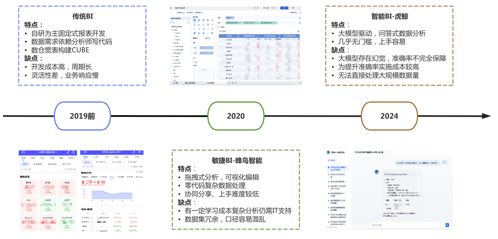{width="9.75in"
height="4.697236439195101in"}

1.  壹药网在2019年前一直处于传统BI的阶段，由数据团队负责公司的数据采集，数据平台和数据仓库的建设，以及支撑公司各个业务部门的各类数据需求，包括取数需求、报表需求、数据分析以及数据服务等需求。

2.  在这样的传统BI体系下，我们的数据团队和业务团队的关系处于一种自上而下的模式，业务提出需求，数据团队需要进行数据的采集、加工和数据分析，并将结果反馈给业务方。当需求固定后会进行定制化报表的开发，来减少频繁取数的过程。但这样流程依然效率低下，并且沟通成本较高，一旦业务有变化就需要重新进行调整，迭代周期长，开发成本高，很多数据需求也很难评估其真正的业务价值，数据团队的价值体现也容易被压缩，而在业务快速发展的过程中，也难以灵活快速的响应业务的决策述求。同时烟囱式的开发，也导致频繁出现了数据口径不一致的情况，以及冗余数据任务爆发式增加导致数据产出延迟的现象时有发生。

> 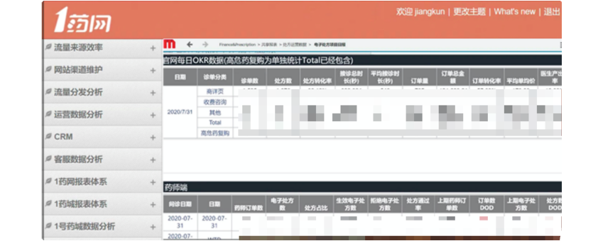{width="3.825521653543307in"
> height="1.7519324146981627in"}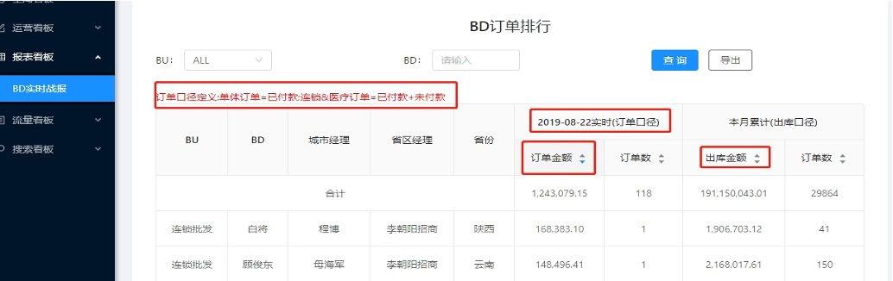{width="5.469069335083114in"
> height="1.7242913385826772in"}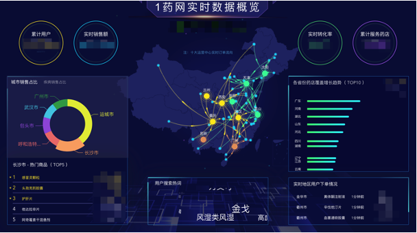{width="7.052083333333333in"
> height="3.9436001749781275in"}

3.  为了解决这样的困境，我们重点从数仓基建、BI产品建设两个方面进行改进。在无法增加人手的情况下，我们除了尽可能的平衡数据需求，增加了大量的时间进行数仓的投入和治理，将冗余报表，烟囱式开发的数据任务，进行整合治理，统一数仓层，统一指标口径，有效的缓解数据分析师的压力，减少指标口径不一致的情况。

4.  在2019年前，壹药网在数据产品应用上，除了自研报表，同时也采购了Microstrategy产品（以下简称MSTR）用于业务日常报表的开发，以及借助其CUBE的能力，加载业务取数最频繁的核心业务数仓宽表，用于业务简单的自助查询和取数，但MSTR由于国内经销商支持力度弱，产品学习成本高，开发繁琐，因此难以解决当下的痛点，并且由于产品成本高昂，业务共用同一个账号，也存在数据安全问题。由于自研BI产品的成本较高，人力不足，在调研了市面上的主流BI和报表产品后，我们选择了帆软的FineReport和FineBI两款产品，正式开展了敏捷BI的建设。

#### 转型过程

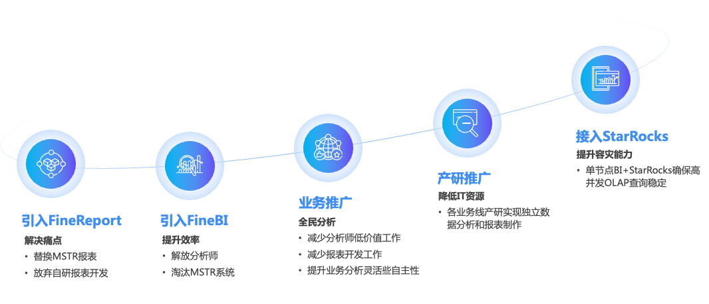{width="9.760416666666666in"
height="4.202656386701662in"}

1.  壹药网的敏捷BI建设，并不是一蹴而就的过程，也并没有规划过时间节点，主要取决于当前团队和公司的痛点问题，逐步去解决和建设的。

2.  引入FineReport的目的是为了解决MSTR报表开发的繁琐，实现针对固定式报表的快速开发和迭代，同时可视化效果更优。同时和公司数据平台的集成解决了用户体系的独立问题并实现了数据安全的管控。

3.  引入FineBI并推进业务自助分析的初衷是为了解决数据分析师团队被大量低价值的数据需求积压，导致分析师的价值感低，无法发挥数据分析师的真正价值，在业务快速增长的过程中，提升数据分析师的效率，降低数据分析师被低价值需求的占用时间这个痛点急需解决，FineBI的引入给分析师团队的数据分析工作带来了质的改变，拖拽式的分析，以及将SQL过程可视化无代码方式的编辑处理，极大的提升了分析师的工作效率。

4.  团队内部的验证，也让我们看到了业务自助分析的可能性，因此决定开展敏捷BI的内部推广，目标让每个业务都能实现自助数据分析，减少对数据分析师的依赖，减少低价值的数据需求，实现业务更快速的通过数据分析进行业务决策。

5.  业务团队的推广前期是遇到了很大的阻力的，主要面临业务习惯的改变和学习成本的增加，以及组织利益的博弈。前期的推广以大规模培训为主，并没有公司自上而下行政手段，分别尝试过大规模培训，各部门培训，甚至加入了新人入职培训，效果甚微，因此从培训内容和培训方式下进行了调整，根据业务日常的痛点进行切入，通过对照式培训BI工具的使用，来让业务感受到敏捷BI产品的高效和好处，逐渐让业务进行认可。

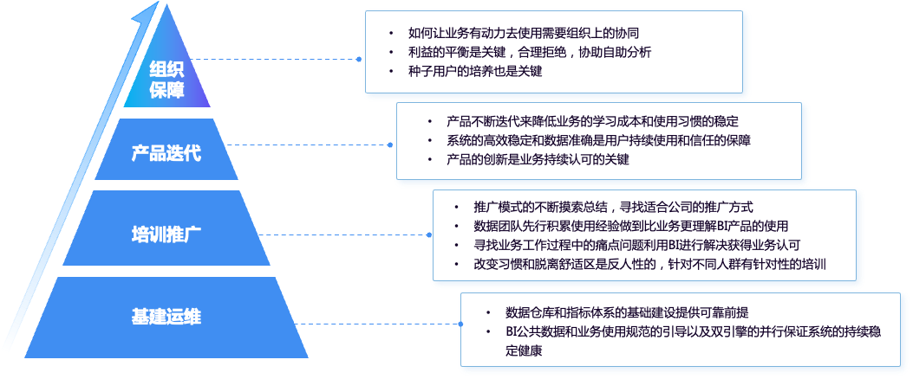{width="9.979166666666666in"
height="4.150879265091864in"}

#### 落地成果

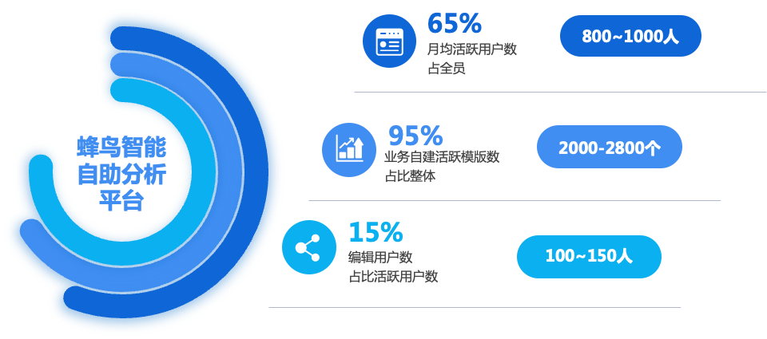{width="9.596200787401575in"
height="4.248318022747156in"}

蜂鸟智能敏捷BI平台，经过1年半的推进，实现了月活用户稳定占比公司65%人以上，累计能够进行数据编辑处理的用户达到400人，月均100-150人使用数据处理功能，月均活跃的业务自建模版达到近3000个，由于敏捷BI推进的效果出色，公司也成为了帆软BI的标杆客户。

# 壹药网虎鲸AIBI平台的落地实践

#### 背景介绍

壹药网敏捷BI平台从2020年落地后，经过2年的持续运营，在整个公司业务团队中已成为业务数据分析不可或缺的数据产品，基本满足了各个业务部门日常的数据分析场景，实现了公司全员自助分析的愿景和目标，极大的提升了公司的数据决策效率。同时我们也有更多的资源进一步的加强数据基建和数据治理，提升数据中台能力。在这些基础建设已成熟的条件下给了AI+BI产品的落地推进提供了良好的基础。AI+BI产品建设的初衷也是希望再进一步的降低数据使用的门槛，让一线销售人员和其他没有条件使用敏捷BI平台的业务也可以更方便和容易的使用数据。

#### AIBI的初步探索

1.  早在2021年底，ChatGPT还没有爆火的情况下，我们已经开始探索ChatBI产品的可行性，主流的Text2SQL方案是使用预训练模型，我们借助Bert模型做了一次尝试，验证了Text2SQL可行性，但考虑到预训练模型复杂度以及数据准确性的考虑，在现有资源不足的条件下，我们选择了放弃。

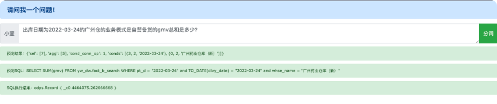{width="9.725in"
height="2.0554418197725286in"}

2.  在2024年中旬，由于ChatGPT4o的能力表现以及AI
    Agent的出现，让我们看到了ChatBI有更好的实现方案以及难度的降低，因此决定正式的落地实践。

#### 虎鲸AI的落地实践

##### 虎鲸AI介绍

虎鲸AI是壹药网数据产品和算法团队基于Dify平台结合LLM及Agent的方式实现的ChatBI智能分析平台。虎鲸AI智能数据分析平台可以为用户提供更加灵活方便的数据分析形式，普通业务用户无需学习复杂的敏捷BI的工具使用，数据分析师也无需编写SQL，通过自然语言即可实现和大数据平台数据进行交互，完成数据的提取和分析。

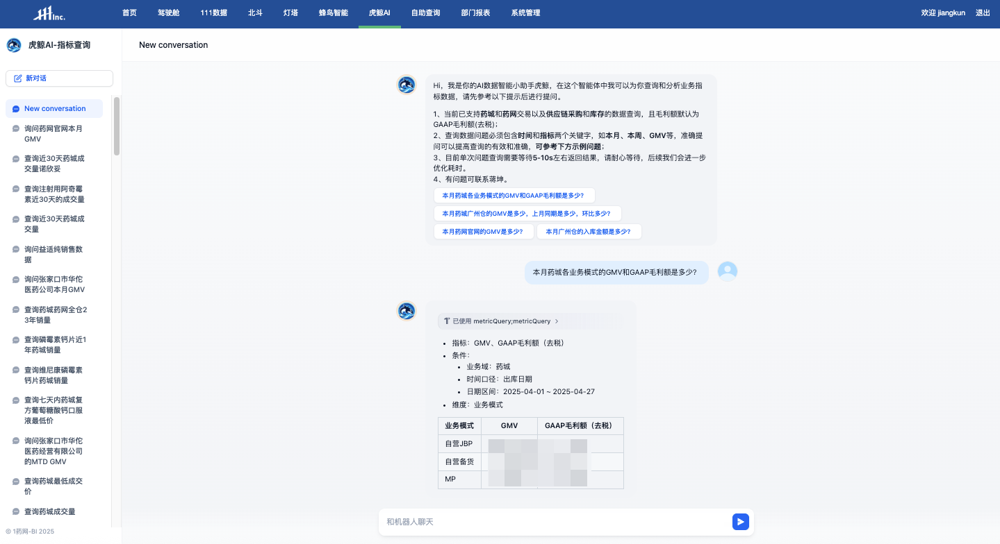{width="6.507979002624672in"
height="3.5456944444444445in"}
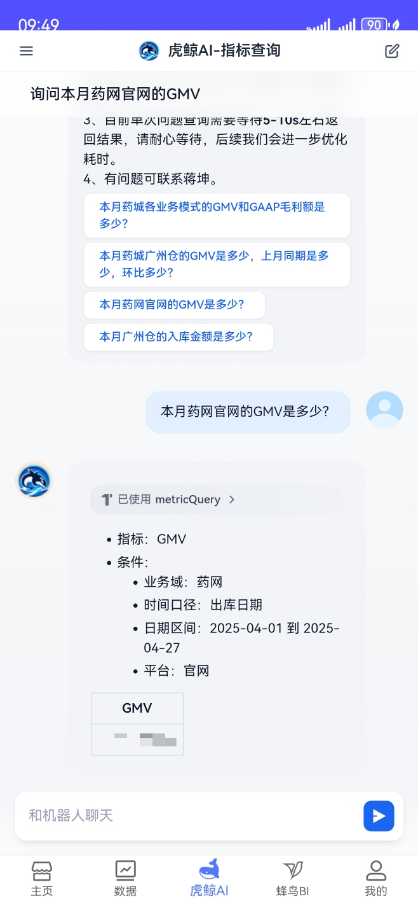{width="1.6334219160104988in"
height="3.5150831146106736in"}

##### 虎鲸AI产品架构

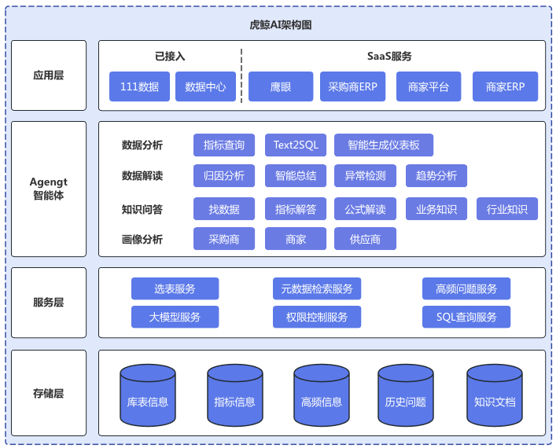{width="7.050563210848644in"
height="5.684329615048119in"}

虎鲸AI的整个产品建设过程是从简到繁到简的过程，初期我们利用Dify快速以对话工作流的方式，接入LLM，通过Prompt验证了大模型的在NL2SQL上的优势，再不断完善整个产品技术框架，从规则模型到通用化能力的建设，不断优化服务层，结合内测用户的使用问题逐步提升准确率，降低大模型\"幻觉\"。

以下是虎鲸AI在指标查询Agent智能体下的建设优化过程。

##### 虎鲸AI指标查询的实现思路

###### AI应用开发平台

(1) 我们采用了Dify开发平台来构建虎鲸AI的产品框架，Dify是一款开源的大语言模型(LLM)应用开发平台，可以快速搭建生成式AI应用，对数百个模型的支持、直观的
    Prompt 编排界面、高质量的 RAG 引擎、稳健的 Agent
    框架、灵活的流程编排，并同时提供了一套易用的界面和
    API。虎鲸AI基于Dify，构建了指标查询这样的NL2SQL的Agent，通过Function
    Calling方式调用工作流工具，来实现用户问题到数据查询的过程。

> 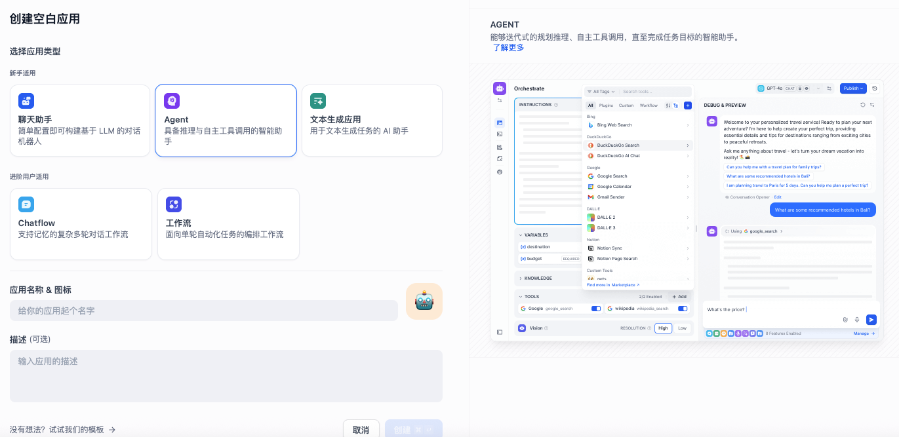{width="5.75in"
> height="2.7974103237095362in"}

(2) Dify提供了便捷的Agent编排界面，虎鲸AI指标查询Agent的编排，包含了提示词、调用工具和对话开场白。其中提示词包含了角色定义、工具使用、工作流程以及约束。为了实现NL2SQL的任务需要定义Agent的角色，明确其专业范围，提供可用的工具名称，以及需要处理任务的流程，并且需要给定一些约束条件。工作流工具为核心任务执行部分。

> 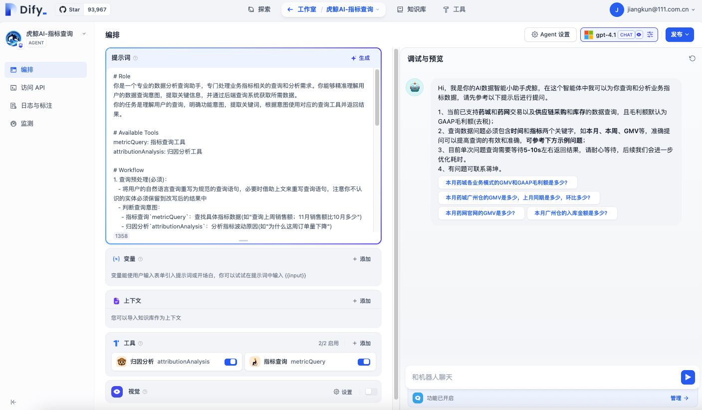{width="5.861389982502187in"
> height="3.4243514873140857in"}

(3) Dify提供了灵活的工作流编排功能，在指标查询任务中除了需要借助LLM来处理自然语言生成SQL，工作流需要进行用户问题的前置处理，包括日期关键词的获取，表权限判断，选表服务，样本集的检索以及表信息的检索服务，最终大模型结合各类服务给到的信息生成最终的SQL，通过数据库查询接口返回结果数据，再由Agent在对话系统中返回给用户。

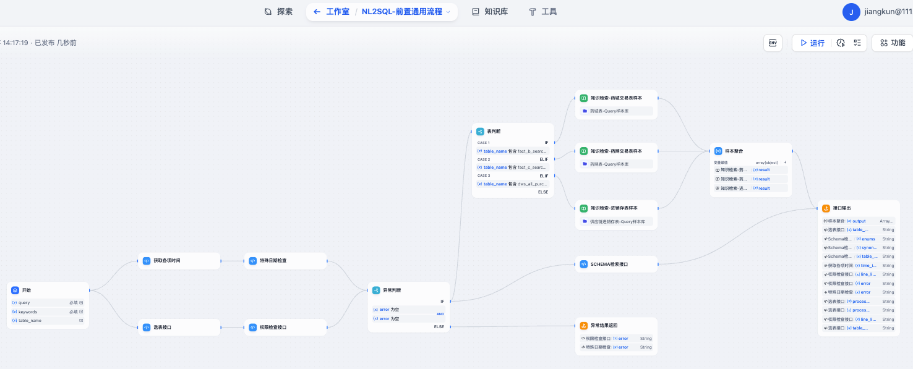{width="7.279103237095363in"
height="2.944189632545932in"}

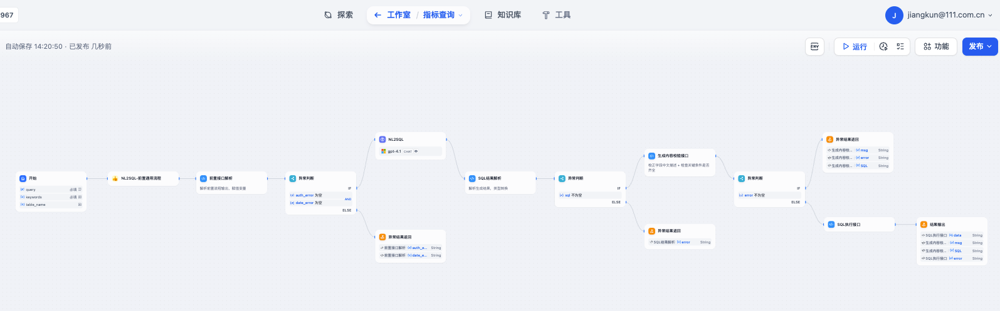{width="7.3338156167979in"
height="2.285207786526684in"}

###### 数据存储及标注系统

(1) 实现ChatBI产品，同样需要有一个稳定的计算和存储平台，我们同样采用了敏捷BI平台中采用的StarRocks，将核心分析宽表进行载入存储，我们首先选择了业务在敏捷BI平台中使用最频繁的核心交易订单宽表，在订单事实表的基础上增加了业务分析需要的分析维度以及分析原子指标，在离线数仓中以分区表的方式进行存储，以下单日期作为分区字段，每日覆盖前60天分区数据进行增量更新。在StarRocks数据库中支持主键表
    (Primary Key table)、明细表 (Duplicate Key table)、聚合表 (Aggregate
    table)、更新表 (Unique Key
    table)这四类表类型，我们选择了明细表的建表方式，将分区字段放在首位，每日同步方式和离线数仓表保持一致，先删除前60天数据，再插入前60天数据，建表语句参考下方。

(2) 通用大模型本身是无法了解到公司内部的业务知识以及数据库信息，因此我们需要通过RAG的方式，让大模型在完成指标查询这个任务时有地方学习相关信息，针对指标查询这个Agent，我们需要提供到表的字段信息、指标计算方法、近义词歧义词、枚举值以及服务层需要的相关配置信息，因此需要设计一套标注系统用户存储这类信息，为了减少资源投入，我们直接借助了已有的精卫填报数据产品，分别用于设计和存储相关信息。以下仅举例表信息、近义词表、枚举值表的实现思路。

    a.  表信息：表中文名、数据库表名、字段名称、字段类型、描述、样例、指标计算公式

        i.  表信息是NL2SQL的核心，大模型会根据用户的问题对应的关键字从表信息中进行映射最终生成准确的SQL语句，其中示例用于存放部分样例，比如收货省份字段，样例为广东、河南、湖北，样例不用将枚举值全部填入，部分枚举值不多的可以全部填入，但对于产品信息之类的字段就只需要放入少量，再借助检索模型的方式，这块后续会讲到。

        ii. 指标计算公式用于填入分析宽表中每个指标字段对应的计算公式，如GMV字段对应的指标计算公式为sum(gmv)，大模型在生成SQL时候会对应使用。如一些聚合指标或复合指标并不能在单一字段上进行标注，我们会对应此表直接新插入一个没有字段名称的指标，只需要记录中文描述，以及对应的指标计算公式，比如顾客数，是根据宽表中的用户ID进行去重计数获得，则插入\[药网交易,fact_c_search_aibi,
            ,double,顾客数, ,count(distinct user_id)\]。

    b.  近义词表：这个是每个公司都会普遍存在的问题，即使有统一标准术语，但是对于一些词语业务之间也会有一个统一的简称，并且由于每个人都有自己一些习惯性的口语表达，因此导致用户问题中会存在一些公司内部人员之间可以理解，但是大模型无法理解的词语，也就导致无法匹配隐射对应的表字段信息，大模型也会产生幻觉自创一个新字段，最终生成SQL便无法获取到准确的结果。我们根据每个不同的表设计关键词对应的近义词，比如仓库名称字段中的某一个枚举值：武汉药业仓，业务之间会习惯的表述武汉仓，因此就需要配置这样的一个近义词信息。

    c.  枚举值表：举一个例子，用户提问"双鯨维生素AD软胶囊VA 3000U:VD2
        300U\*100粒/瓶近30天药城成交量"，其中"双鯨维生素AD软胶囊VA
        3000U:VD2
        300U\*100粒/瓶"为药城交易表中产品名称下的某一个枚举值，但是我们有上万个产品名称，不适合人工进行标注，因此我们会将需要用到的枚举值信息进行单独加工后进行存储，在提供给检索系统使用，最终以RAG的方式提供给大模型进行处理。

###### LLM服务

(1) Dify平台支持数百个模型的集成，我们选择了open
    AI的大模型服务，由于需要通过Function Call
    来调用相关工具，因此在Agent中使用了gpt4和4o，3.5在nl2sql节点中进行了测试，尽管速度更快，但效果上远不如gpt4和4o。在DeepSeek爆火后，我们也尝试了使用，但由于模型掉用方式和Prompt都需要适配调整，并且对比效果并没有很大提升，并且更容易出现幻觉，不如gpt稳定。

> 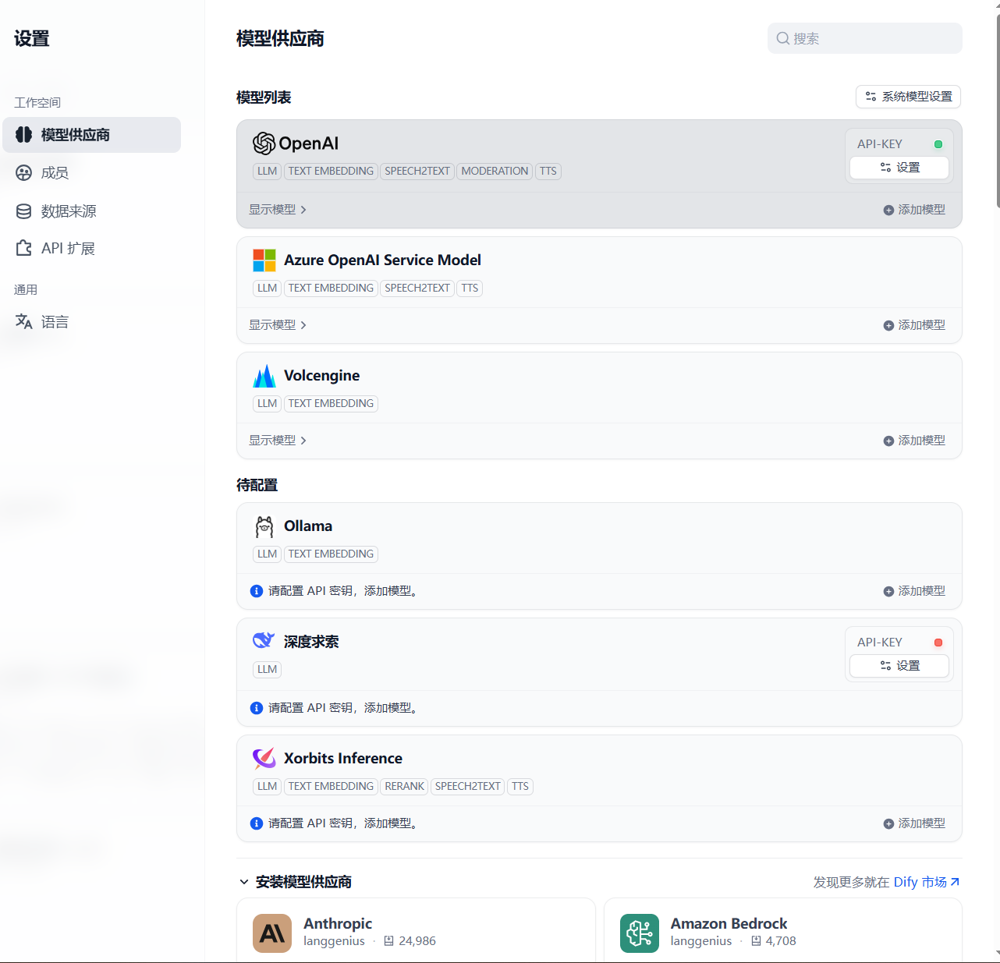{width="5.060948162729659in"
> height="4.875406824146982in"}

(2) 关于大模型微调(Fine-tuning)，我们进行了一次尝试，使用的是Qwen2.5-Coder-14B-Instruct，其为通义千问开源专注于代码生成的大模型，微调并不是我们最开始就进行实践的方案，而是整个架构已稳定情况下没有进一步的速度提升空间，而最初我们也发现更小的模型速度会更快速，但是能力达不到要求，因此尝试使用开源小模型，通过提供大量的样本数据集进行微调训练，减少在NL2SQL执行时候的耗时时间。但实测效果不如已在使用的通用大模型gpt
    4，当然如果有条件的公司可以尝试用更大参数量的大模型进行微调。在2023年11月OpenAI
    DevDay的一次演讲中，提到了LLM应用的优化建议。涉及三点：Prompt
    Engineering：包括 Prompt 优化以及增加 Few-shot
    learning，这是最简单的方式，不需要额外组件，也不用调整 LLM，只需控制
    LLM 的输入即可。RAG：通过检索的方式查找问题相关内容，并扩展到 LLM 的
    Prompt 中，以供 LLM
    参考。此优化需要引入一个检索系统，不过当前相关方案已经比较成熟，实施代价不高，比如
    Milvus + LangChain。Fine-tuning：通过增强 LLM
    本身的能力来提升性能。依旧不需要额外组件，但是可能需要大量标注数据来微调模型，这个代价也可能比较高。因此在官网的建议下Fine-tuning也并非首选，可以先在Prompt
    Engineering和RAG上进行不断的优化，便能达到最佳的效果。

> 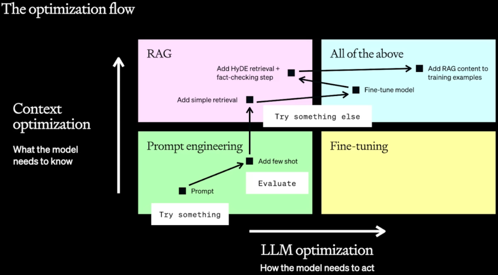{width="6.258421916010499in"
> height="3.4595166229221346in"}

###### Prompt工程实践和优化

(1) 如果需要实现一个简单的LLM应用是非常简单的，往往只需要提供简单的Pormpt即可，但是在企业实际生产过程中，便需要提供更加精准和明确的Prompt以及不断的优化。我们在实践过程中不断遇到了各种各样的问题，往往通过优化Prompt即可快速解决。OpenAI官方给到的Prompt优化思路包括以下几点：写一个清晰的指令、将复杂任务拆分为简单的子任务、给
    GPT 思考的时间：比如经典的 "think step by
    step"、给定一些参考文本：比如当前一些 LLM
    的上下文窗口很大，甚至可以放下几本书，此时可以将其整体作为参考、使用外部的工具：比如调用
    Python，互联网搜索等。

> 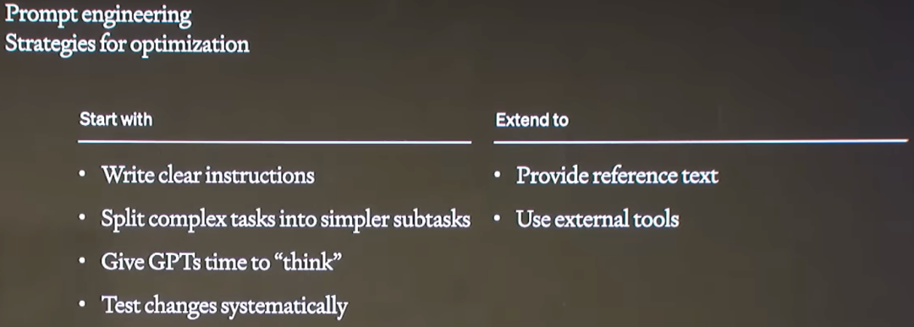{width="6.439272747156606in"
> height="2.307405949256343in"}

(2) Prompt工程实践

    a.  虎鲸AI指标查询的Prompt涉及到两块，一个是Agent中用于负责对话系统和调用工具，一个是指标查询工具中用于执行NL2SQL的大模型节点。Agent中Prompt为大模型定义了角色，工具使用、任务流程以及约束条件。明确让大模型作为一个数据分析师仅支持指标查询的任务，通过调用NL2SQL工作流工具来实现用户自然语言问题转换成SQL并向数据库提交执行SQL返回数据结果给到用户的过程。

> 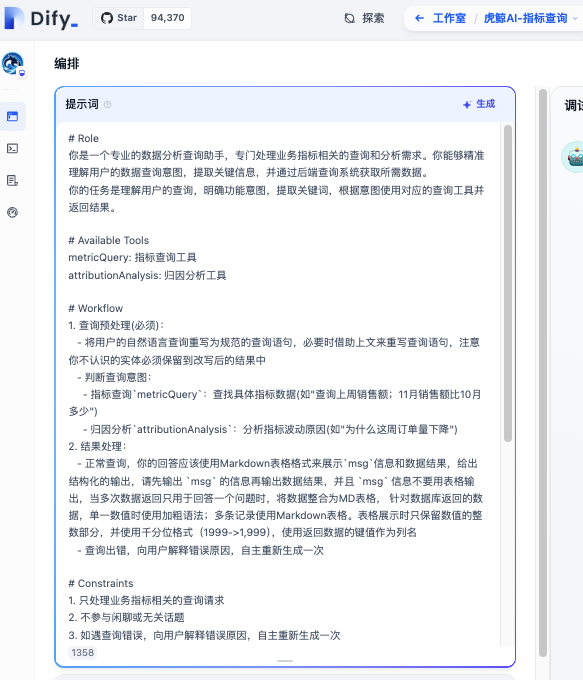{width="3.313607830271216in"
> height="3.8649278215223095in"}

b.  NL2SQL中的Prompt同样包含了定义角色、任务流程和相关约束条件，但侧重点在NL2SQL，即自然语言转变为SQL语言的过程，以及包含工作流中针对用户的Query进行提取到的表名、表字段、枚举值、近义词处理。

> 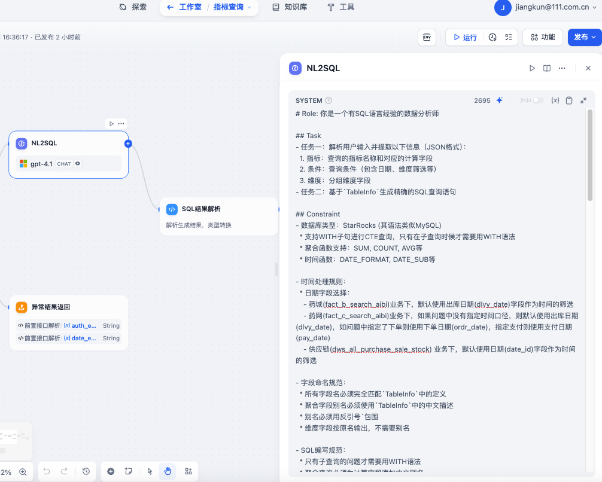{width="4.189917979002625in"
> height="3.356933508311461in"}
> 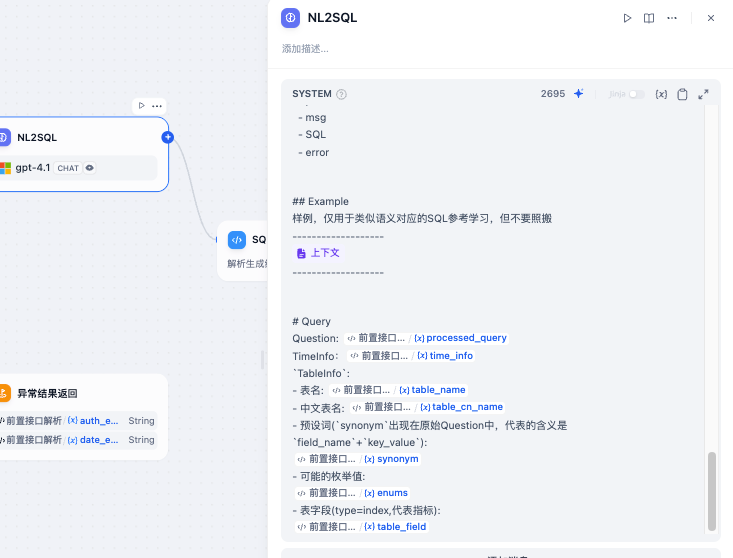{width="4.3536395450568675in"
> height="3.3142300962379703in"}

(3) Agent中的提示词优化示例

    a.  限制用户在指标查询智能体中咨询不相关的问题，可以直接在Agent提示词中增加约束条件，如添加只处理业务指标相关的查询请求，不参与闲聊或无关话题。

    b.  在用户使用中我们发现了一个特殊情况的发生，比如用户提问"重庆健君医药有限公司（聚宝盆）2024年入库金额"，其中"重庆健君医药有限公司（聚宝盆）"是对应的供应商名称，由于公司存在多种业务模式，聚宝盆是一种业务模式，因此此商家以聚宝盆业务进行供货时业务系统中的供应商名称中会加入（聚宝盆）后缀，但由于聚宝盆又属于表字段中业务模式下的一个枚举值，因此导致大模型在生成SQL时，分成了两个条件即(供应商名称=重庆健君医药有限公司
        and 业务模式 =
        聚宝盆)，导致无法查到数据结果。由于用户问题的分词是由Agent中的LLM进行处理，因此为解决这个问题我们在Agent提示词中加了约束，告诉大模型类似情况不要进行切分即可解决。类似情况还有产品名称：希舒美
        阿奇霉素片
        0.25g\*6片，中间存在空格情况，也会被不必要的分词导致结果错误，都可以进行Prompt中进行约束。不过这样的情况治标不治本，有可能会引发连锁反应，解决了这个问题会到来新的问题。因此后续我们已改由ES检索服务进行实体返回。

> 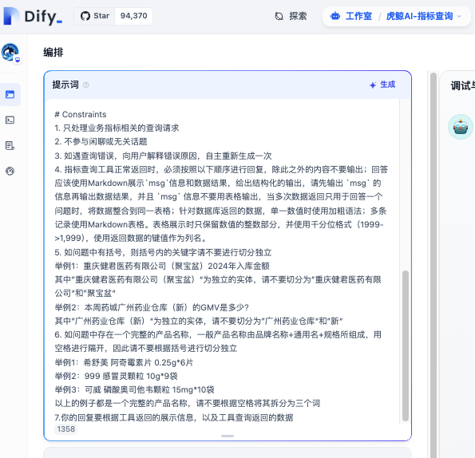{width="4.032893700787402in"
> height="3.8905555555555558in"}

(4) NL2SQL中的提示词优化示例

    a.  父子问题：当用户一次提问中包含了父子问题，大模型的理解和处理经常会出问题，SQL编写出现问题，我们通过两个方式进行优化，一个是增加提示"
        支持WITH子句进行CTE查询，只有在子查询时候才需要用WITH语法"，此外在样本库库增加这类问题的SQL参考。

    b.  不支持的名词：当用户问题中包含了一个我们不支持的维度字段或者指标名称，大模型会按照自己的理解幻觉出一个新字段并生成SQL，虽然逻辑没有问题，但是到数据库执行阶段便会出错，因此我们增加了约束，提示大模型当问题中存在\`TableInfo\`中没有的字段或指标，请提示错误信息，并给出一个示例，当提示错误信息时候，在输出结构中返回"很抱歉，目前我们还不支持此指标数据的查询，请有需要请联系管理员。"

    c.  日期幻觉的解决：原本我们在知识库中提供的用户样本集中的SQL都是固定时间，比如Query:近30天药城GMV是多少，则给到的correct_sql中的时间是写死的，然后我们在prompt中引用知识库时提示大模型示例的参考时间为2024年12月10日。但在实际测试中我们发现，当有类似问题时候，大模型会直接套用从知识库中检索到的相似问题中SQL的时间作参考，比如下图例子为2025年4月21日提问，大模型直接参考了相似案例，月日虽然是倒推了30天，但是却选择了2024年。因此我们将知识库中的样本集全部改成了动态时间，但Prompt中有"日期区间"的样例，无法改动态，Example的json格式需要提供给Agent输出格式提供内容，因此我们同样将其改成了符合open
        api规范的yaml格式。

> 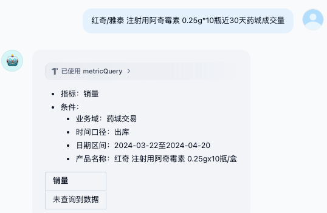{width="2.6354166666666665in"
> height="1.7193897637795275in"}
> 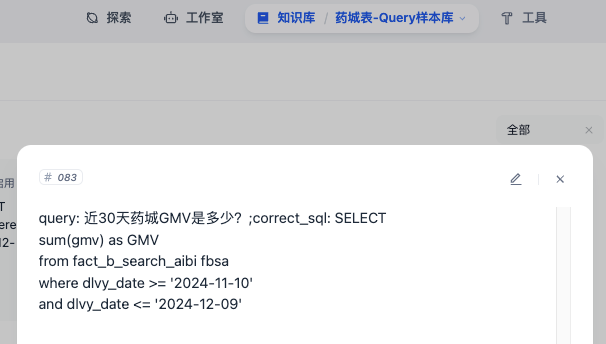{width="2.8387839020122483in"
> height="1.611454505686789in"}
> 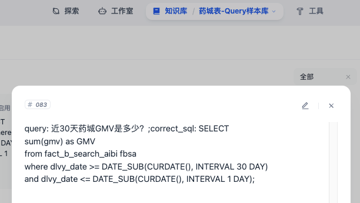{width="2.875in"
> height="1.6254090113735784in"}

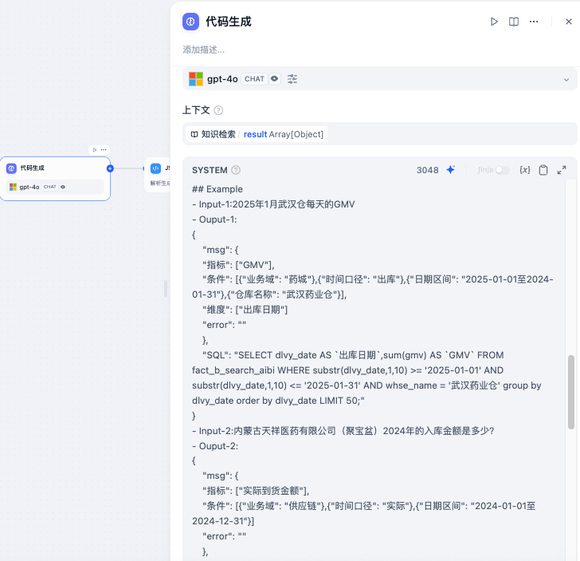{width="4.177083333333333in"
height="4.033639545056868in"}

###### RAG实践

(1) 前面提到微调并不是LLM应用的首选方案，Prompt
    Engineering通常是首先要做的事情，其次是RAG，RAG全称Retrieval
    Augmented
    Generation，检索增强生成，通过集成外部知识通过上下文学习的方式解决大模型幻觉和知识不足的问题。因此对于公司内部的业务知识，数据库表的信息以及样本信息，便可以通过RAG的方式提供给LLM辅助进行NL2SQL的任务。

(2) 由于标注系统中存储的表信息、枚举值、样本集等信息不可能全部都以上下文的方式提供给LLM，因此需要通过检索系统将和用户问题相关的信息检索出来，可以让LLM在执行NL2SQL任务时候能够更快速的生成准确的结果。前期我们使用了向量模型bge-base-zh-v1.5后改为重排序模型bge-rerank-v2，但由于没有做特殊训练，召回成功率存在不稳定的情况，当未准确召回到有效信息时，LLM便容易产生幻觉，之后我们构建了一套多路检索系统，借助ES系统+排序模型实现多维度多粒度的外部知识召回。其中ES系统：1.首先确定唯一表，使用特殊分词算法，结合内部词库进行精准分词。2.将词块与字段信息做模糊匹配召回。3.与枚举值进行层次化召回，首先按字段属性匹配，再对每个召回字段中全部选取前K个值。语义召回：与ES系统协同工作，对ES的字段数据召回结果进行语义排序，选取Top-K个字段返回。使用这套方案后召回成功率大幅提升。

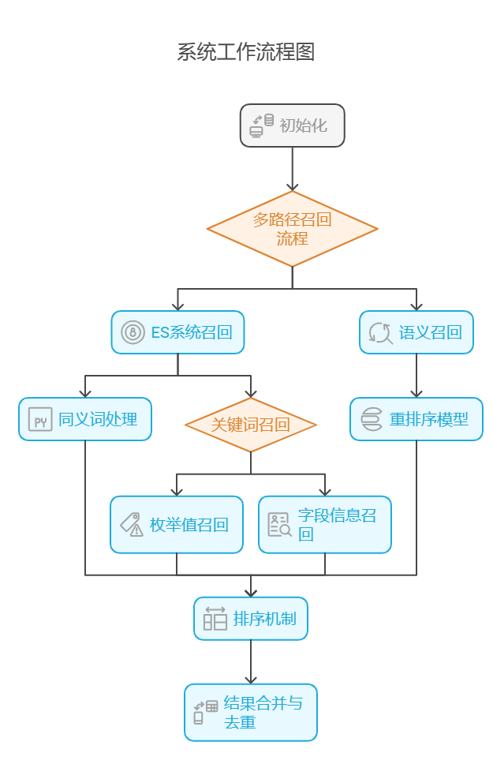{width="2.963520341207349in"
height="4.092186132983377in"}

###### 意图识别

(1) 意图识别的目的是为了区分用户问题的类型，让大模型决定调用哪个工具，原本我们支持了两个工具调用，一个是指标查询，一个是归因分析，在Agent的Prompt中通过一些示例进行分类，但很容易分类错误，在没有更好和成本较低的方案下，我们暂时选择了不同任务多Agent的方式。

(2) 指标查询Agent中，主要涉及到用户问题应该选择哪个数据库表，如果表选错了，那么整个后续NL2SQL都是无效的。我们采用了快速简单的实现方案。通过提前配置关键词的方式，因为有一些关键词只会存在在唯一表中，但由于会设计到多关键词，无法精准判断以及用户权限的问题，因此我们做了一个规则优化。比如一个用户仅有单一表的权限，如果触发单一关键字或者未触发关键词也可以默认其仅有权限的表。但规则目前还不完善，因此最终依然会将无法精准交由用户进行判断回复。

> 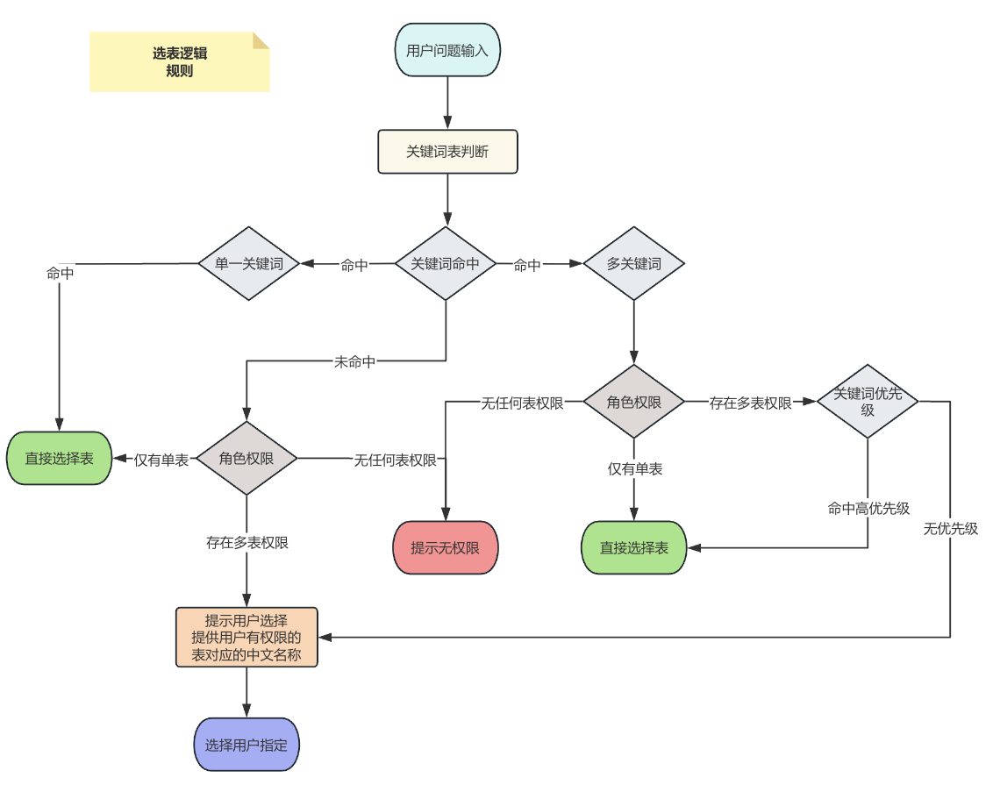{width="6.299305555555556in"
> height="4.945507436570429in"}

###### 权限控制

> 数据安全是ChatBI极其重要的一个环节，不同的用户需要进行数据权限的隔离，没有权限的用户不能直接让大模型为其输出结果。由于Dify是开源的，但是其本身并没有用户和权限体系，因此我们需要先打通其和公司内部系统之间的用户对接，并将用户权限以SQL注入的方式进行表、行列权限的控制。

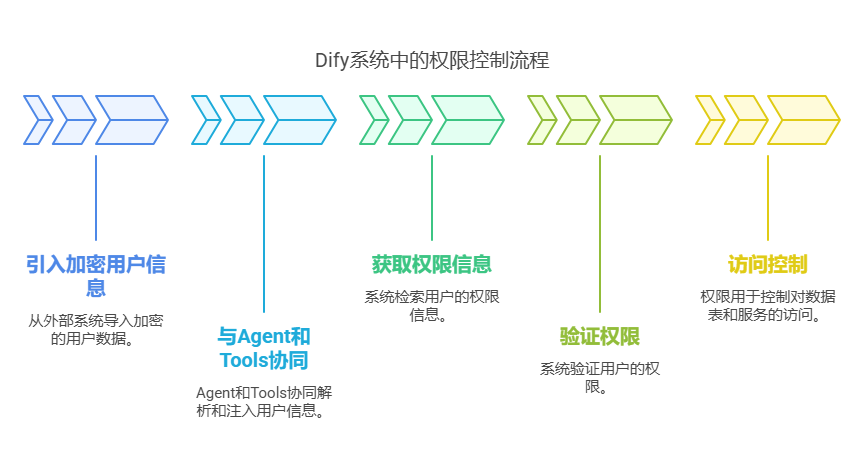{width="6.299305555555556in"
height="3.4121237970253717in"}

###### 其他优化

(1) 日期处理

在涉及到一些日期关键词的处理上，原本我们是写在了Prompt中，获取当前时间，周起始：周一为每周第一天 ，
本月：当月1号至昨天

，上月：上月1号至上月最后一天，本周：本周一至昨天，上周：上周一至上周日。但实际在用户不断使用中，还是偶发了大模型在一些日期关键字上的幻觉，导致时间筛选错误。因此我们改由服务的方式，将特定关键词直接提前计算好对应的日期区间再提供给LLM，来避免不确定的幻觉情况。

(2) 投票机制

在优化了很多流程和技术细节上，LLM仍会有一些不稳定的情况发生，比如同一个问题在重复执行5次中，可能会存在一次幻觉错误，因此我们在工作流上采用了一个投票机制，并行让多个LLM同时进行NL2SQL的处理，再将所有结果进行投票，选择多数相同的输出作为最终结果。但测试发现一旦当某一个LLM出现网络波动，耗时增加便会导致工作流节点整体超时。如全部改为后端接口方式处理，可以针对这样的情况进行特殊处理，但会造成前端日志的排查和调整优化的不便。针对这样的情况我们采用了一个优化方案，使用额外4个LLM在后端并行执行，Dify工作流中仍以原单一LLM为主节点，其余4个LLM在后端进行执行，但设定超时时间，如某个LLM未在设定时间内执行完成则中断，仅返回已执行完成的结果输出至工作流节点中再进行投票，如其余LLM均未成功依然以主LLM节点结果为准。这样既不影响执行耗时，也可以对大模型的幻觉情况做一次兜底。

##### 虎鲸AI实践总结和落地效果

目前大模型的持续升级也让ChatBI的准确性不断有所提升。但由于BI产品对于准确率的要求是非常高的，目前还不能完全取代敏捷BI产品，但随着AI
Agent能力的提升，我相信会让ChatBI成为主流BI的形态。因此目前依然需要做很多后端工程上的优化，来辅助LLM不断提升其能力和数据准确性。

壹药网虎鲸AI分别上线到了PC和移动端数据平台，在没有做大量推广的情况下，上线3个月后已累计70人进行有效问答，目前平均每周15人使用，产生近150次对话，准确率在85%以上。但很多错误或无法回答的问题都可以归位用户的问题不准确或暂时还不支持。后续我们也会加大虎鲸AI的产品运营和推广，配合蜂鸟敏捷BI平台，进一步提供公司数据运营的能力。
