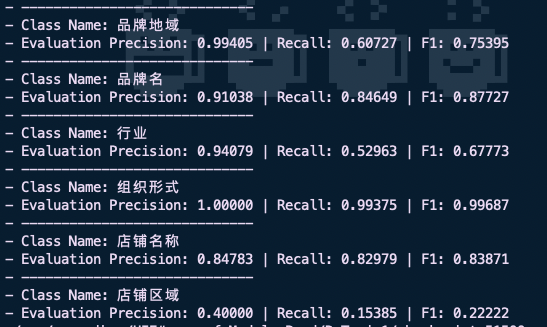
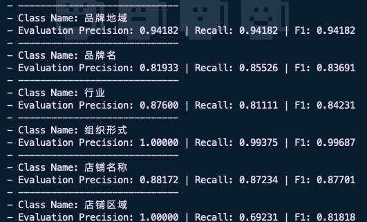
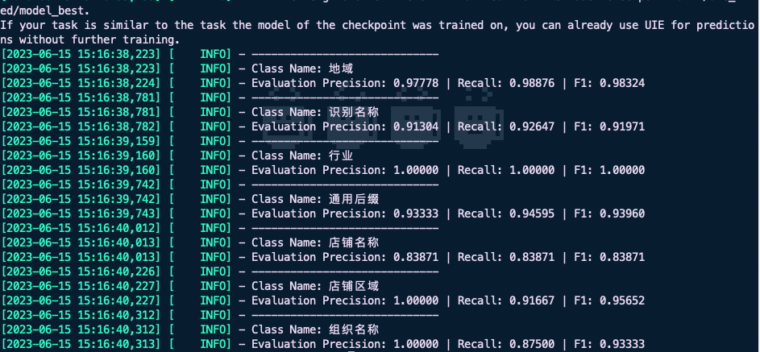
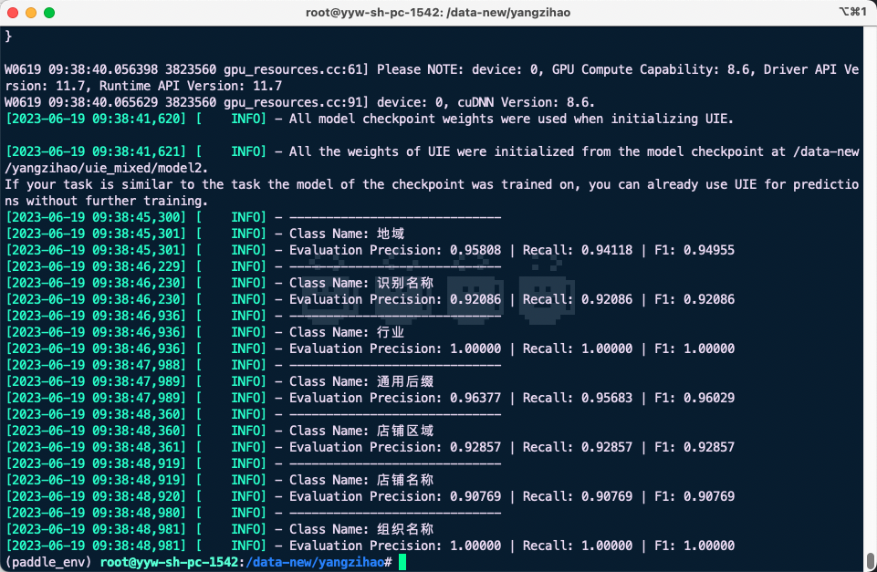
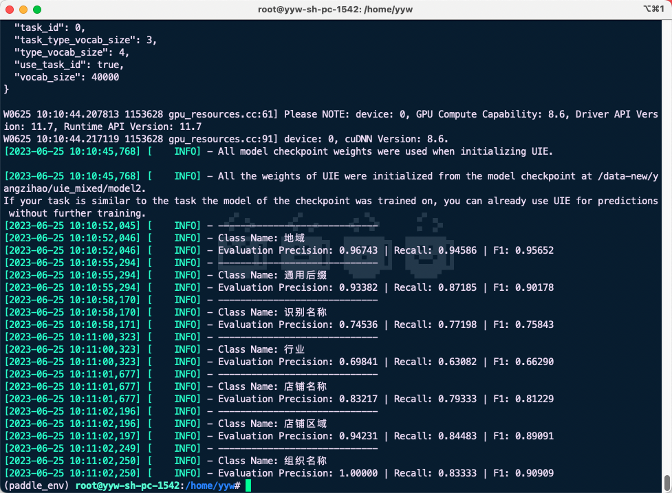
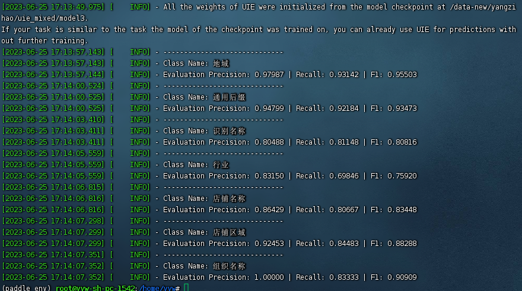
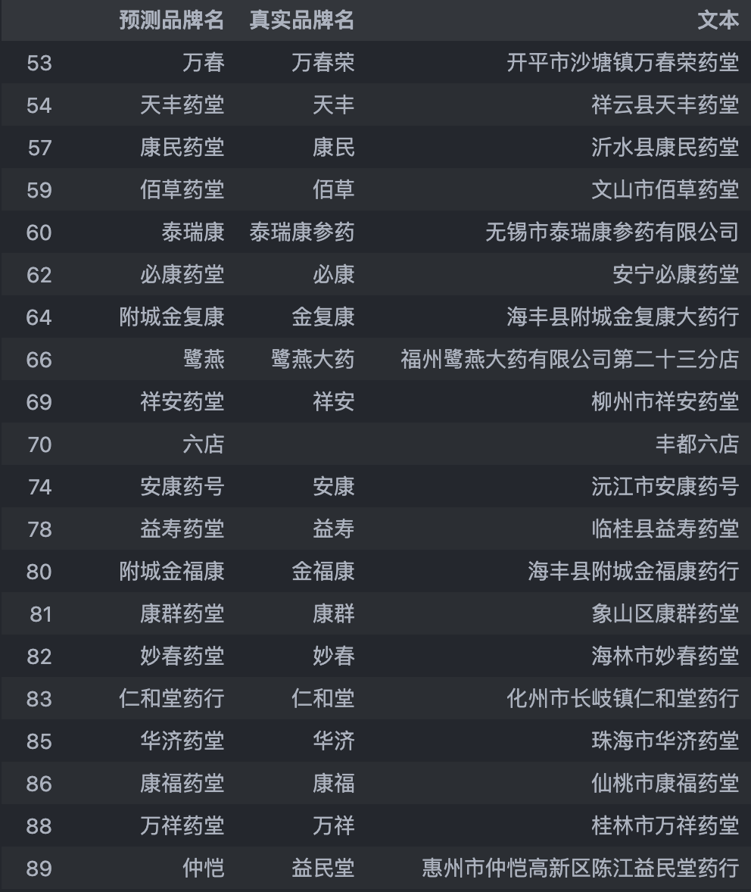
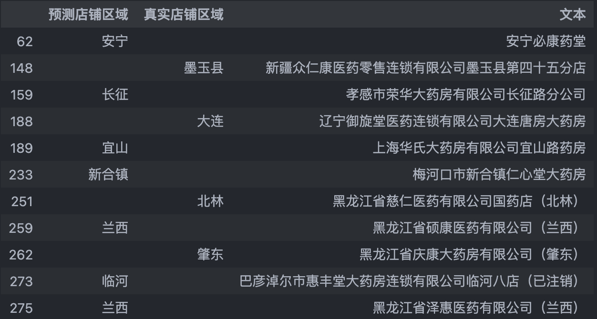
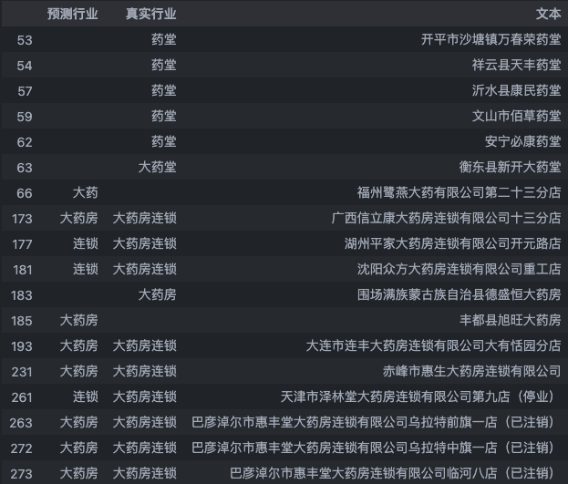

**评价指标**：**precision精确率、recall召回率、f1值**

- precision：查准率。以"品牌名"类别举例，正确识别品牌名的数目占全部识别为品牌名数目的比例。范围在0-1之间，越大越好。

- recall：查全率。以"品牌名"类别举例，正确识别为品牌名的数目占全部实际为品牌名数目的比例。范围在0-1之间，越大越好。

- f1值：F1分数定义为精确率和召回率的调和平均值。能够综合反应精确率和召回率，范围在0-1之间，越大越好。

## 2023-05-22

测试结果如下：

{width="5.697916666666667in"
height="3.40625in"}

**品牌地域**、**店铺区域**、**行业**三种实体类别识别效果较差。

测试集为按照特殊规则挑选出的较难样本，模拟真实业务场景下对特殊案例的识别效果。

\@王子龙 准确率统计：84.88 %

溯源，分析出可能的原因有：

1.  **店铺区域**类别相对其他类别较少，类别数不平衡使得模型无法准确识别出来。

2.  **品牌地域**与**店铺区域**存在语义上的重合，比如品牌地域为"*广州"*、店铺区域为"*广州番禺区"*时，模型混淆不清，导致识别错误。

3.  检查训练数据，发现以下问题：

    a.  训练时的标注与识别时的标注不一致：地域 -\> 品牌地域；分店地区
        -\> 店铺区域

    b.  由于机器分词工具的不准确性，将较多样本的店铺区域错误标注为品牌地域

4.  **行业**类别下存在多种嵌套关系，*医药连锁、药房连锁、连锁，*以及存在一些特殊例子如："柳州市祥安药堂"、"丰都县旭旺大药房"等个体品牌案例，其店名与行业产生歧义，因而导致模型识别效果不佳。

## 2023-05-25

测试结果如下：

{width="5.53125in"
height="3.34375in"}

模型整体精度有较大幅度提升，**品牌名**类别精度略有下降。

\@王子龙 准确率统计：91.98 %

在第一次训练测试后的经验上，为了解决上述的诸多问题，采取了以下措施：

1.  统一训练数据的规则名和识别时的规则名。将训练数据中的标注"地域"改为"品牌地域"，店铺区域同理。

2.  对1万条训练数据采取准确的分类筛选和预处理：

    a.  将1万条数据按照是否存在**店铺区域**对半拆分，其中存在**店铺名称**的数据将"市、区、县、镇"等明确含有地区词后缀的部分，转移到**店铺区域**中；不存在**店铺区域**的数据中，将**店铺名称**含"市、区、县、镇"等的例子进行移除。

    b.  剔除掉1万条训练数据中的个体品牌例子，如上述中的"丰都县旭旺大药房"、"柳州市祥安药堂"。再人工校对标注后，加入到后续单独训练的流程中。

## 2023-5-30

{width="7.760416666666667in"
height="3.0517541557305337in"}

将经过预处理后的单体药店数据加入先前的数据集中，打散重组。对UIE-base重新训练，得到结果如上图所示。

## 2023-6-15

{width="6.299305555555556in"
height="2.91919072615923in"}

使用少量数据（药店，按4个种类采样100；医疗机构，按4类采样100）：

药店：有店铺区域的（2类）、没有店铺区域的、单体药店

医疗机构：医院、基层、专业、其他

经过手工标注、预处理、过滤。其中，删除了医疗机构中含有公司的样本，**旨在避免和药店数据产生混淆结果。**

进行**规则合并**的第一次实验，验证同时识别**药店、生产企业、商业公司、医疗机构**四种数据的可行性。

数据集划分：80%训练、10%验证、10%测试

测试精度如图。实验结果显示效果较好，实际测试下来可以较为准确识别不同类型的数据

## 2023-6-16

{width="6.299305555555556in"
height="4.109952974628172in"}

在第一次合并规则实验的基础上加大数据集，药店采样800条，医疗机构800条。

经过预处理、标注校对、过滤之后，整体数据集数目为1540条。

数据集划分：80%训练、10%验证、10%测试

测试精度如图。

后续：从数据库中采样固定比例的药店、医疗机构数据作为固定测试集，对规则合并后的两个模型进行统一测试、计算精度。选取最优模型。

## 2023-6-20

训练设置同上一次。在本次训练中对训练数据进行一些预处理：**针对医疗机构中含有公司的样本进行过滤**。期望在预测时面对医疗机构中的公司名称使用原先的实体规则对其进行拆分识别，而不是像大学、研究院等识别为一个组织整体。精度结果如图：

{width="6.299305555555556in"
height="4.622929790026247in"}

需要对**行业**、**识别名称**两个类别进行负例分析。研究如何改进

## 2023-6-25

添加了更多的数据集，集中标注了**识别名称**、**行业**两个类别，并对之前的训练数据进行了标注上的校对。识别结果显示有了显著提升。

{width="6.299305555555556in"
height="3.5147265966754158in"}

## 药店测试集负例分析

1.  总测试集数目为**276**，其中**品牌名**识别错误的数量：**38**，占比：**0.1376**

> 从错误案例中抽样比较识别结果与真实结果：
>
> {width="5.760416666666667in"
> height="6.840494313210849in"}
>
> 可以看到由于缺少"柳州市祥安药堂"这样特殊案例的标注，模型的识别会有所偏差，无法精准匹配，而是与真实结果存在包含关系。

2.  总测试集数目为**276**，其中**店铺区域**识别错误的数量：**11**，占比：**0.0398**

从全部错误案例比较识别结果与真实结果：

{width="5.99375in"
height="3.2075174978127734in"}

1.  错误例子集中在**店铺区域**为两个字的情况下，没有明确地区词后缀，识别效果有所下降

2.  特殊例子如"xx药堂"、"xx大药房"等个体品牌以及含有括号备注信息等情况识别效果下降

<!-- -->

3.  总测试集数目为**276**，其中**行业**识别错误的数量：**56**，占比：**0.2028**

从错误案例中抽样比较识别结果与真实结果：

{width="5.99375in"
height="5.108637357830271in"}

1.  个体品牌例子识别不准

2.  **行业**词没有精准匹配，存在涵盖关系
